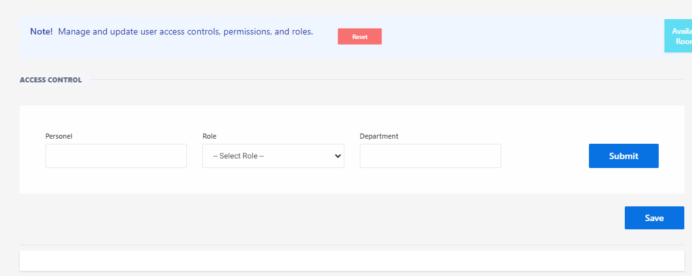

# Access Control

**HEMS - Hotel Manager**

# Access Control Page

## Overview
The Access Control page is designed to manage and update user access controls, permissions, and roles within the hotel management system. This page is essential for ensuring that personnel have the appropriate access levels to perform their duties effectively.

## Features

### Personnel Assignment
- **Personnel:** 
  - A dropdown menu to select the personnel for whom you want to assign roles and permissions.
  
- **Role:** 
  - A dropdown menu to choose the role for the selected personnel. Roles determine the level of access and permissions within the system.
  
- **Department:** 
  - A dropdown menu to specify the department to which the personnel belongs.

### Buttons

- **Reset:** 
  - Clears all current selections, allowing you to start over if needed.
  
- **Submit:** 
  - Applies the selected role and department to the chosen personnel.
  
- **Save:** 
  - Saves all changes made to the access control settings.

## Usage

1. **Select Personnel:** 
   - Use the dropdown menu to choose the personnel you want to assign a role to.
   
2. **Choose Role:** 
   - Select the appropriate role from the dropdown menu that defines the access level and permissions.
   
3. **Specify Department:** 
   - Choose the department from the dropdown menu to which the personnel belongs.
   
4. **Submit the Form:** 
   - Click the 'Submit' button to apply the selected role and department to the personnel.
   
5. **Save Changes:** 
   - Click the 'Save' button to save all changes made to the access control settings.
   
6. **Reset the Form (if needed):** 
   - Click the 'Reset' button to clear all fields and start over.

This page ensures that user access controls are managed efficiently, maintaining proper security and access levels across different departments in the organization.
