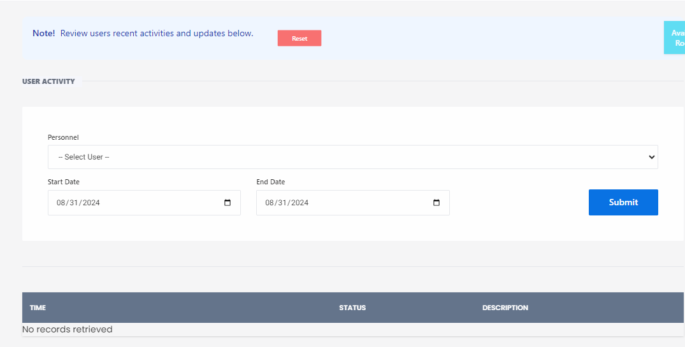

# Activitypanel

**HEMS - Hotel Manager**



## User Panel

The User Panel allows administrators to review and manage user activities within the system. Below are the sections included on the User Panel:

## Overview
- **Note**: Review users' recent activities and updates below.

## Filters
- **Personnel**: A dropdown menu to select the user whose activities you want to review.
- **Start Date**: A date picker to select the start date for the activity review period.
- **End Date**: A date picker to select the end date for the activity review period.
- **Submit Button**: A button to apply the selected filters and retrieve user activities.

## User Activity Table
- **TIME**: The timestamp of the activity.
- **ACTIVITY**: A brief description of the activity performed by the user.
- **STATUS**: The status of the activity (e.g., completed, pending).
- **DESCRIPTION**: Additional details about the activity.

## Example
Below is an example of how the User Panel might look:

```markdown
# User Panel

## Overview
**Note**: Review users' recent activities and updates below.

## Filters
- **Personnel**: 
  - [ ] John Doe
  - [ ] Jane Smith
  - [x] Robert Brown
- **Start Date**: 08/01/2024
- **End Date**: 08/31/2024
- Submit

## User Activity Table
| TIME       | ACTIVITY       | STATUS    | DESCRIPTION         |
|------------|----------------|-----------|---------------------|
| 10:00 AM   | Login          | Completed | User logged in      |
| 10:15 AM   | Update Profile | Pending   | Updated email address |
| 11:00 AM   | Logout         | Completed | User logged out     |

**No records retrieved** if no activities match the selected filters.
