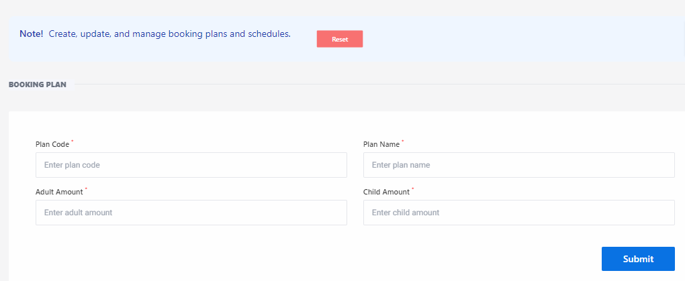
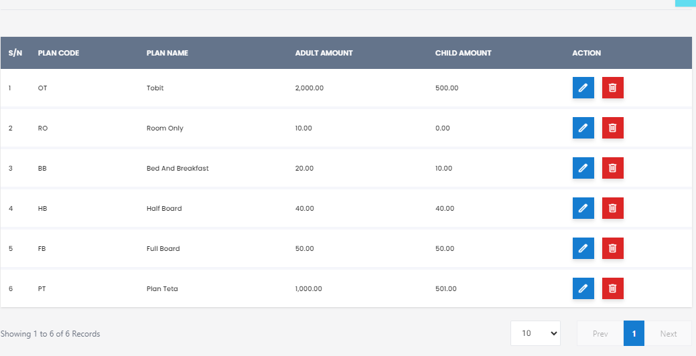

# Booking Plan

**HEMS - Hotel Manager**

# Booking Plan 

The BookingPlan Page is designed to create, update, and manage booking plans and schedules. This page allows administrators to define various booking plans, including details such as plan codes, names, and pricing for adults and children.

## Table of Contents
- Overview
- BookingPlan Form
- Actions
- Creating a New BookingPlan
- Editing a BookingPlan
- Deleting a BookingPlan

## Overview
The BookingPlan Page provides a user-friendly interface for managing booking plans. Administrators can use this page to ensure that all booking plans are up-to-date and accurately reflect the hotel's offerings.

## BookingPlan Form
The BookingPlan form includes the following fields:
- **Plan Code**: A unique identifier for the booking plan.
- **Plan Name**: The name of the booking plan.
- **Adult Amount**: The price for adults under this plan.
- **Child Amount**: The price for children under this plan.

### Example
| Field        | Description                       |
|--------------|-----------------------------------|
| Plan Code    | Enter the unique plan code        |
| Plan Name    | Enter the name of the booking plan|
| Adult Amount | Enter the price for adults        |
| Child Amount | Enter the price for children      |

## Actions
- **Reset**: Clears all input fields in the form.
- **Submit**: Saves or updates the booking plan information.

## Creating a New BookingPlan
To create a new booking plan, follow these steps:
1. Navigate to the BookingPlan Page.
2. Fill in the required fields: Plan Code, Plan Name, Adult Amount, and Child Amount.
3. Click the "Submit" button to save the new booking plan.

## Editing a BookingPlan
To edit an existing booking plan, follow these steps:
1. Navigate to the BookingPlan Page.
2. Select the booking plan you want to edit.
3. Update the necessary fields.
4. Click the "Submit" button to apply the changes.

## Deleting a BookingPlan
To delete a booking plan, follow these steps:
1. Navigate to the BookingPlan Page.
2. Select the booking plan you want to delete.
3. Confirm the deletion in the prompt that appears.

## Conclusion
The BookingPlan Page is an essential component of the hotel management system, enabling administrators to manage booking plans efficiently. By maintaining accurate booking plans, the hotel can ensure that all pricing and scheduling information is up-to-date and consistent.

# Booking Plan Table

The Booking Plan Page is designed to manage and display information about the various booking plans available in the hotel management system. This page allows administrators to create, view, edit, and delete booking plans, ensuring that all pricing and plan details are up-to-date.

## Table of Contents
- Overview
- Booking Plan Table
- Actions
- Creating a New Booking Plan
- Editing a Booking Plan
- Deleting a Booking Plan

## Overview
The Booking Plan Page provides a centralized interface for managing booking plans. These plans define the pricing and conditions for different types of bookings, such as room-only rates, bed and breakfast, half board, and full board options.

## Booking Plan Table
The booking plan table displays the following columns:
- **S/N**: Serial number of the booking plan.
- **Plan Code**: A unique identifier for the booking plan.
- **Plan Name**: The name of the booking plan.
- **Adult Amount**: The price for adults under this plan.
- **Child Amount**: The price for children under this plan.
- **Action**: Options to view, edit, or delete the booking plan.

### Example
| S/N | Plan Code | Plan Name         | Adult Amount | Child Amount | Action       |
| --- | --------- | ----------------- | ------------ | ------------ | ------------ |
| 1   | OT        | Tent              | $2,000.00    | $500.00      | Edit/Delete  |
| 2   | RO        | Room Only         | $10.00       | $0.00        | Edit/Delete  |
| 3   | BB        | Bed and Breakfast | $20.00       | $10.00       | Edit/Delete  |
| 4   | HB        | Half Board        | $40.00       | $40.00       | Edit/Delete  |
| 5   | FB        | Full Board        | $50.00       | $50.00       | Edit/Delete  |

## Actions
- **Edit**: Allows the administrator to modify booking plan details.
- **Delete**: Removes the booking plan from the system.
- **View**: Displays detailed information about the booking plan.

## Creating a New Booking Plan
To create a new booking plan, follow these steps:
1. Navigate to the Booking Plan Page.
2. Click on the "Add New Booking Plan" button.
3. Fill in the required fields: Plan Code, Plan Name, Adult Amount, and Child Amount.
4. Click the "Submit" button to save the new booking plan.

## Editing a Booking Plan
To edit an existing booking plan, follow these steps:
1. Navigate to the Booking Plan Page.
2. Click on the "Edit" button next to the booking plan you want to modify.
3. Update the necessary fields.
4. Click the "Submit" button to apply the changes.

## Deleting a Booking Plan
To delete a booking plan, follow these steps:
1. Navigate to the Booking Plan Page.
2. Click on the "Delete" button next to the booking plan you want to remove.
3. Confirm the deletion in the prompt that appears.

## Conclusion
The Booking Plan Page is an essential component of the hotel management system, enabling administrators to manage booking plans efficiently. By maintaining accurate booking plans, the hotel can ensure consistent and transparent pricing for its services.
