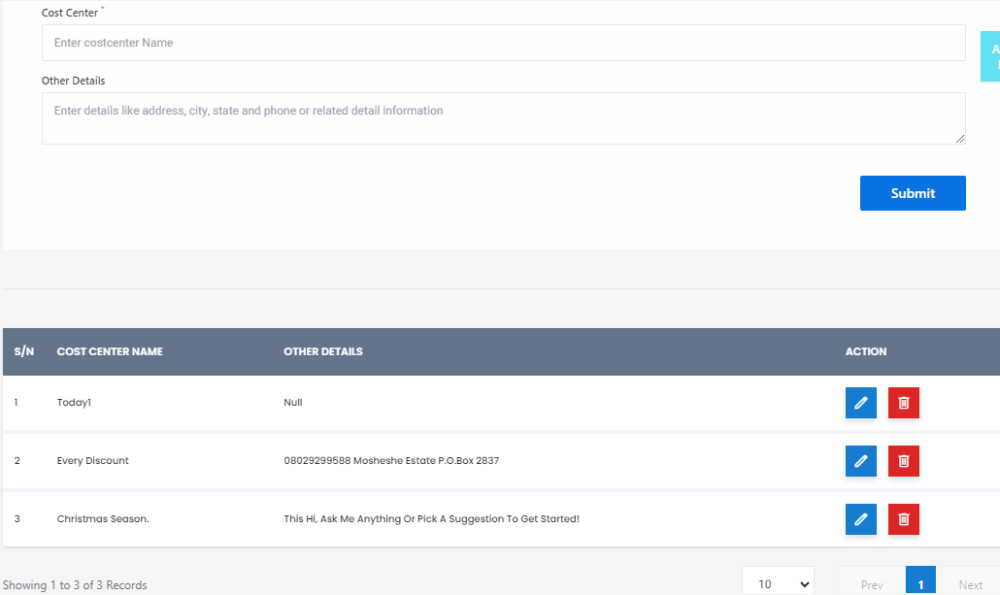

# Cost Center

**HEMS - Hotel Manager**

# Cost Center Page

The Cost Center Page is designed to help administrators manage and organize cost centers within the hotel management system. This page allows users to create, view, and manage cost centers, which are essential for tracking expenses and budgeting.

## Features

### 1. Cost Center Creation Form
At the top of the page, there is a form to create new cost centers. The form includes the following fields:
- **Cost Center Name**: A text field to enter the name of the cost center.
- **Other Details**: A text area to enter additional information such as address, city, state, and phone number.

Once all fields are filled, the **Submit** button can be clicked to create the cost center.

### 2. Cost Center List Table
Below the form, there is a table displaying the list of existing cost centers. The table includes the following columns:
- **S/N**: Serial number of the cost center.
- **Cost Center Name**: The name of the cost center.
- **Other Details**: Additional details about the cost center.
- **Action**: Buttons to edit or delete the cost center.

### 3. Actions
- **Edit**: Click the pencil icon to edit the cost center details.
- **Delete**: Click the trash bin icon to delete the cost center.
- **More Options**: Click the downward pointing arrows for additional options or details.

### 4. Pagination
At the bottom of the table, there are pagination controls to navigate through the list of cost centers. It shows the number of records displayed on the current page and allows navigation to previous or next pages.

## Example
Here is an example of how the cost center list might look:

| S/N | Cost Center Name | Other Details | Action |
| --- | ---------------- | ------------- | ------ |
| 1   | Today1           | Null          | Edit/Delete/More Options |
| 2   | Every Discount   | 0002298568 Mondelez Europe Polska 20-837 | Edit/Delete/More Options |

## Usage
The Cost Center Page is used by administrators to manage financial tracking and budgeting efficiently. By setting up various cost centers, the hotel can better organize its expenses and ensure accurate financial reporting.

