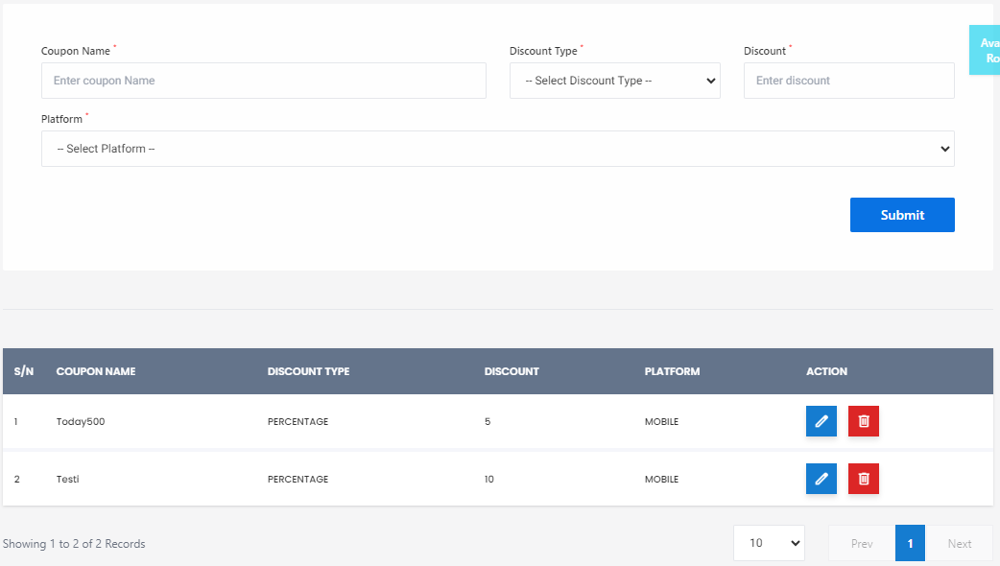

# Coupon Plan

**HEMS - Hotel Manager**

# Coupon Plan Page

The Coupon Plan Page allows administrators to create, manage, and view coupon plans for the hotel management system. This page is essential for setting up discounts and promotions that can be applied to various services or products offered by the hotel.

## Features

### 1. Coupon Creation Form
At the top of the page, there is a form to create new coupons. The form includes the following fields:
- **Coupon Name**: A text field to enter the name of the coupon.
- **Discount Type**: A dropdown menu to select the type of discount (e.g., Percentage, Fixed Amount).
- **Enter Discount**: A numerical field to specify the discount value.
- **Platform**: A dropdown menu to select the platform where the coupon will be applicable (e.g., Mobile, Web).

Once all fields are filled, the **Submit** button can be clicked to create the coupon.

### 2. Coupon List Table
Below the form, there is a table displaying the list of existing coupons. The table includes the following columns:
- **S/N**: Serial number of the coupon.
- **Coupon Name**: The name of the coupon.
- **Discount Type**: The type of discount (e.g., Percentage).
- **Discount**: The discount value.
- **Platform**: The platform where the coupon is applicable.
- **Action**: Buttons to edit or delete the coupon.

### 3. Actions
- **Edit**: Click the pencil icon to edit the coupon details.
- **Delete**: Click the trash bin icon to delete the coupon.
- **View Details**: Click the overlapping squares icon to view more details about the coupon.

### 4. Pagination
At the bottom of the table, there are pagination controls to navigate through the list of coupons. It shows the number of records displayed on the current page and allows navigation to previous or next pages.

## Example
Here is an example of how the coupon list might look:

| S/N | Coupon Name | Discount Type | Discount | Platform | Action |
| --- | ----------- | ------------- | -------- | -------- | ------ |
| 1   | Today30     | Percentage    | 5%       | Mobile   | Edit/Delete/View |
| 2   | Guest       | Percentage    | 10%      | Mobile   | Edit/Delete/View |

## Usage
The Coupon Plan Page is used by administrators to manage promotional offers efficiently. By setting up various coupons, the hotel can attract more customers and encourage repeat business.

