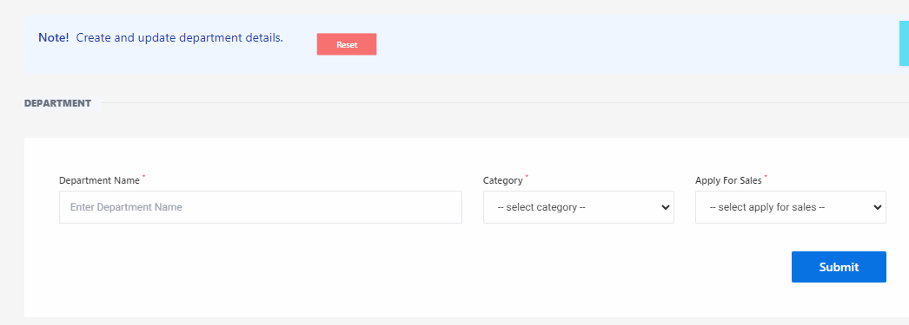
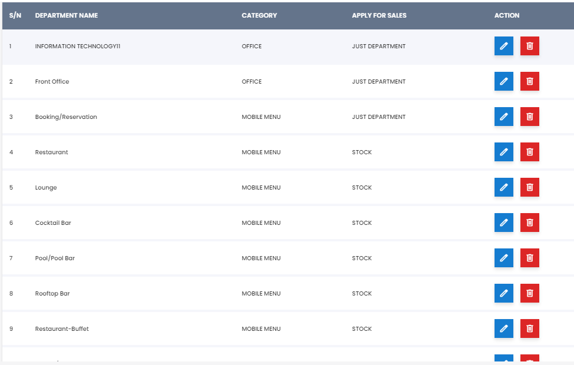

# Department 

**HEMS - Hotel Manager**

# Department Page

The Department Page allows users to create and update department details within the hotel management system. This page is essential for organizing and managing different departments efficiently.

## Features

### Department Form

- **Department Name:** 
  - A text input field where users can enter the name of the department.
  
- **Category:** 
  - A dropdown menu that allows users to select the category to which the department belongs.
  
- **Apply For Sales:** 
  - A dropdown menu to specify whether the department is applicable for sales.

### Buttons

- **Reset:** 
  - This button clears all the input fields, allowing users to start over if needed.
  
- **Submit:** 
  - This button submits the form with the entered details to create or update the department information.

## Usage

1. **Enter Department Name:** 
   - Type the name of the department in the text input field.
   
2. **Select Category:** 
   - Choose the appropriate category from the dropdown menu.
   
3. **Select Apply For Sales:** 
   - Indicate whether the department applies for sales by selecting the relevant option from the dropdown menu.
   
4. **Submit the Form:** 
   - Click the 'Submit' button to save the department details.
   
5. **Reset the Form (if needed):** 
   - Click the 'Reset' button to clear all fields and start over.

This page ensures that all department-related information is captured accurately and can be easily managed within the system.

## Department Overview

The Department Overview page provides a comprehensive list of all departments within the hotel management system. This page is crucial for administrators to manage and oversee departmental information efficiently.

## Table Columns

- **S/N:** 
  - Serial Number for each department entry.
  
- **Department Name:** 
  - The name of the department, such as Front Office, Housekeeping, Restaurant, etc.
  
- **Category:** 
  - The category to which the department belongs, such as Office or Mobile Menu.
  
- **Apply For Sales:** 
  - Indicates whether the department is involved in sales, typically marked as 'Stock'.
  
- **Action:** 
  - Provides options to edit, delete, or view more details about the department.

## Departments List

### 1. Front Office
- **Category:** Office
- **Apply For Sales:** Stock

### 2. Housekeeping
- **Category:** Mobile Menu
- **Apply For Sales:** Stock

### 3. Restaurant
- **Category:** Mobile Menu
- **Apply For Sales:** Stock

### 4. Lounge
- **Category:** Mobile Menu
- **Apply For Sales:** Stock

### 5. Cocktail Bar
- **Category:** Mobile Menu
- **Apply For Sales:** Stock

### 6. Pooltop Bar
- **Category:** Mobile Menu
- **Apply For Sales:** Stock

### 7. Rooftop Bar
- **Category:** Mobile Menu
- **Apply For Sales:** Stock

## Actions

- **Edit:** 
  - Allows administrators to modify department details.
  
- **Delete:** 
  - Enables the removal of a department from the list.
  
- **More Options:** 
  - Provides additional actions or details related to the department.

This page ensures that all department-related information is organized and easily accessible for efficient management.

