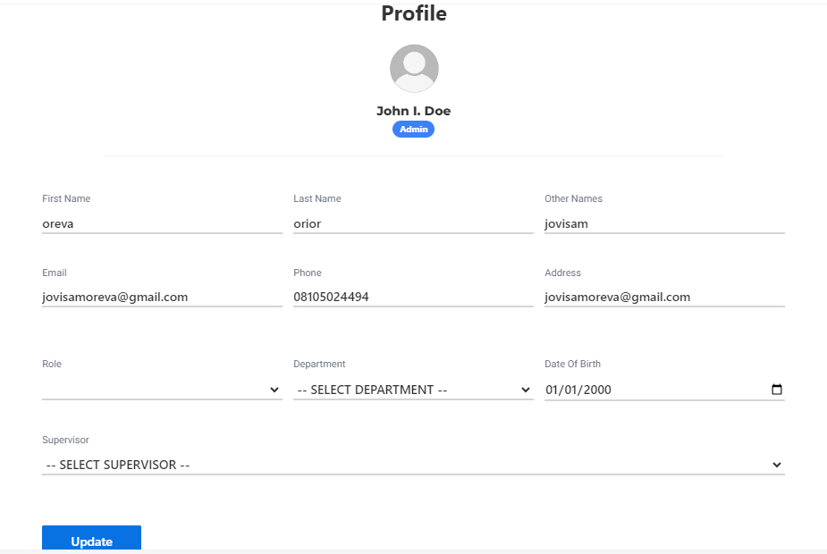

# Profile

**HEMS - Hotel Manager**



## Profile Page

The Profile Page allows users to view and update their personal information. Below are the sections included on the Profile Page:

## Profile Picture
- **Profile Picture**: Users can upload or change their profile picture.

## Personal Information
- **First Name**: The user's first name.
- **Last Name**: The user's last name.
- **Email**: The user's email address.
- **Phone Number**: The user's phone number.
- **Address**: The user's residential address.

## Job Details
- **Job Role**: The user's job role within the hotel.
- **Department**: A dropdown menu to select the user's department.
- **Date of Birth**: A date picker interface to select the user's date of birth.
- **Supervisor**: A dropdown menu to select the user's supervisor.

## Actions
- **Update Button**: A button to save any changes made to the profile.

## Example
Below is an example of how the Profile Page might look:

```markdown
# Profile Page

## Profile Picture
!Profile Picture

## Personal Information
- **First Name**: John
- **Last Name**: Doe
- **Email**: john.doe@example.com
- **Phone Number**: +1234567890
- **Address**: 123 Main St, Anytown, USA

## Job Details
- **Job Role**: Manager
- **Department**: 
  - [ ] Front Desk
  - [ ] Housekeeping
  - [x] Administration
  - [ ] Maintenance
- **Date of Birth**: 01/01/1980
- **Supervisor**: 
  - [ ] Jane Smith
  - [x] Robert Brown
  - [ ] Emily White

## Actions
- Update
