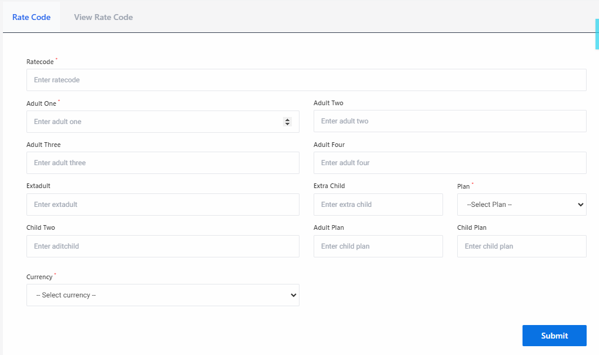
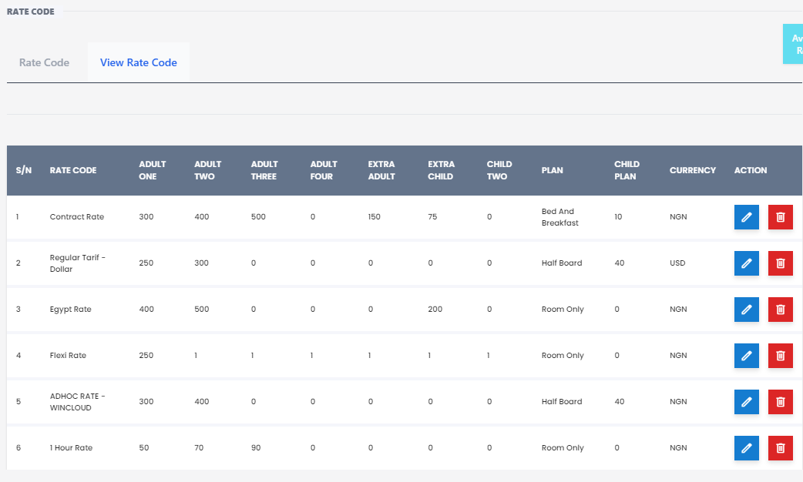

# Rate Code

**HEMS - Hotel Manager**

# Rate Code

The RateCode Page is designed to manage and display information about the different rate codes used in the hotel management system. This page allows administrators to create, view, edit, and delete rate codes, which are essential for defining the pricing structure of the hotel's services.

## Table of Contents
- Overview
- RateCode Table
- Actions
- Creating a New RateCode
- Editing a RateCode
- Deleting a RateCode

## Overview
The RateCode Page provides a centralized interface for managing rate codes. Rate codes are used to define the pricing for various services offered by the hotel, such as room rates, packages, and special offers. This page ensures that administrators can efficiently manage these codes to maintain accurate pricing information.

## RateCode Table
The rate code table displays the following columns:
- **S/N**: Serial number of the rate code.
- **Action**: Options to view, edit, or delete the rate code.
- **Rate Code**: The unique identifier for the rate code.
- **Description**: A brief description of the rate code.
- **Rate**: The pricing associated with the rate code.
- **Status**: The current status of the rate code (e.g., Active, Inactive).

### Example
| S/N | Action | Rate Code | Description | Rate | Status |
| --- | ------ | --------- | ----------- | ---- | ------ |
| 1   | Edit/Delete | RC001 | Standard Room Rate | $100 | Active |
| 2   | Edit/Delete | RC002 | Deluxe Room Rate | $150 | Active |
| 3   | Edit/Delete | RC003 | Weekend Special | $120 | Inactive |

## Actions
- **Edit**: Allows the administrator to modify rate code details.
- **Delete**: Removes the rate code from the system.
- **View**: Displays detailed information about the rate code.

## Creating a New RateCode
To create a new rate code, follow these steps:
1. Click on the "Add New RateCode" button.
2. Fill in the required fields, including Rate Code, Description, Rate, and Status.
3. Click "Save" to add the new rate code to the system.

## Editing a RateCode
To edit an existing rate code, follow these steps:
1. Click on the "Edit" button next to the rate code you want to modify.
2. Update the necessary fields.
3. Click "Save" to apply the changes.

## Deleting a RateCode
To delete a rate code, follow these steps:
1. Click on the "Delete" button next to the rate code you want to remove.
2. Confirm the deletion in the prompt that appears.

## Conclusion
The RateCode Page is a vital component of the hotel management system, enabling administrators to manage the pricing structure effectively. By maintaining accurate rate codes, the hotel can ensure consistent and transparent pricing for its services.

# View Rate Code Page

The View Rate Code Page displays a comprehensive list of rate codes used for pricing rooms based on occupancy. Below are the key components and functionalities of this page:

## Table Columns
- **S/N**: Serial number of the rate code entry.
- **Rate Code**: The name or identifier of the rate code (e.g., Contract Rate, Regular Tarif).
- **Adult One**: Rate for one adult.
- **Adult Two**: Rate for two adults.
- **Adult Three**: Rate for three adults.
- **Adult Four**: Rate for four adults.
- **Extra Adult**: Additional rate for extra adults.
- **Extra Child**: Additional rate for extra children.
- **Child Two Plan**: Rate for a child under the "Child Two Plan."
- **Currency**: The currency in which the rates are listed (e.g., NGN, USD).
- **Action**: Icons for editing or deleting the rate code entries.

## Example Entries
- **Contract Rate**: 
  - Adult One: 300
  - Adult Two: 400
  - Adult Three: 500
  - Extra Child: 75
  - Currency: NGN

- **Regular Tarif - Dollar**: 
  - Adult One: 250
  - Adult Two: 300
  - Extra Child: 0
  - Currency: USD

- **Egypt Rate**: 
  - Adult One: 400
  - Adult Two: 600
  - Extra Child: 200
  - Currency: NGN

- **Flexi Rate**: 
  - Adult One: 250
  - Extra Child: 1
  - Currency: NON

- **ADHOC RATE - WINCLOUD**: 
  - Adult One: 300
  - Adult Two: 400
  - Extra Child: 40
  - Currency: NGN

- **1 Hour Rate**: 
  - Adult One: 50
  - Adult Two: 70
  - Currency: NON

## Actions
- **Edit**: Icon to modify the rate code details.
- **Delete**: Icon to remove the rate code entry.

This page allows users to view and manage different rate codes effectively, ensuring that pricing is accurate and up-to-date for various occupancy scenarios.
