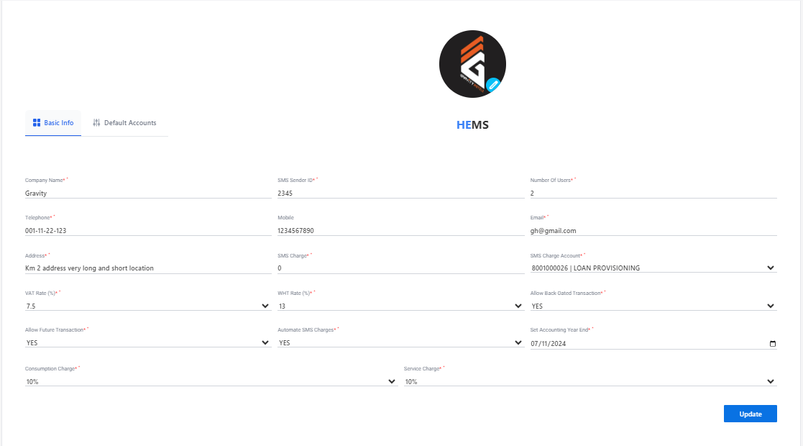
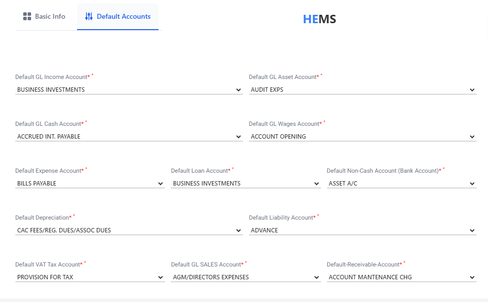

# Settings

**HEMS - Hotel Manager**

# Settings

# Settings Page

The Settings Page allows users to customize their account and system preferences. Below are the key sections and options available:

## Company Information
- **Company Name**: Displays the name of the company.
- **Serial Number**: Unique identifier for the company.

## User Management
- **Number of Users**: Indicates the total number of users associated with the account.

## Date and Time Settings
- **Date/Time**: Allows users to set the current date and time.
- **Time Zone**: Dropdown menu to select the appropriate time zone.

## GPS Settings
- **GPS**: Options to configure GPS settings.

## Communication Settings
- **Email Address**: Field to enter the primary email address.
- **2G Fallback**: Toggle switch to enable or disable 2G fallback.
- **SMS Fallback**: Toggle switch to enable or disable SMS fallback.

## Network Settings
- **IP Address**: Fields to enter the IP addresses for network configuration.

## Address Book / Remote Monitoring
- **Address Book**: Section to manage address book entries.
- **Remote Monitoring**: Options for remote monitoring settings.

## Update
- **Update Button**: Click to save and apply the changes made on the settings page.

This page provides a comprehensive set of options to tailor the system according to user preferences and operational requirements.

## Default Accounts
This section enables users to set default accounts for different financial categories. Each account setting has a dropdown menu for selecting the appropriate account.

### Account Settings
- **Default GL Income Account**: Select the default General Ledger (GL) account for income.
- **Default GL Asset Account**: Choose the default GL account for assets.
- **Default GL Cash Account**: Set the default GL account for cash transactions.
- **Default GL Wages Account**: Select the default GL account for wages.
- **Default Expense Account**: Choose the default account for expenses.
- **Default Loan Account**: Set the default account for loans.
- **Default Non-Cash Account (Bank Account)**: Select the default non-cash bank account.
- **Default Depreciation Account**: Choose the default account for depreciation.
- **Default Liability Account**: Set the default account for liabilities.
- **Default VAT Tax Account**: Select the default account for VAT tax.
- **Default GL Sales Account**: Choose the default GL account for sales.
- **Default Receivable Account**: Set the default account for receivables.

### Example Entries
- **Default GL Income Account**: BUSINESS INVESTMENTS
- **Default GL Asset Account**: AUDIT EXPS
- **Default GL Cash Account**: ACCRUED INT. PAYABLE
- **Default GL Wages Account**: ACCOUNT OPENING
- **Default Expense Account**: BILLS PAYABLE
- **Default Loan Account**: BUSINESS INVESTMENTS
- **Default Non-Cash Account (Bank Account)**: ASSET A/C
- **Default Depreciation Account**: CAC FEES/REG. DUES/ASSOC DUES
- **Default Liability Account**: ADVANCE
- **Default VAT Tax Account**: PROVISION FOR TAX
- **Default GL Sales Account**: AGM/DIRECTORS EXPENSES
- **Default Receivable Account**: ACCOUNT MAINTENANCE CHG

This page provides a comprehensive set of options to tailor the financial account settings according to user preferences and operational requirements.
