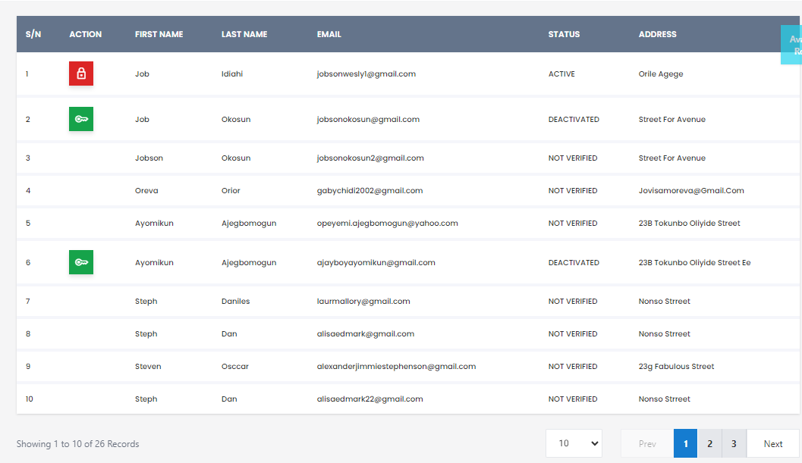

# User

**HEMS - Hotel Manager**

# User Page

The User Page is designed to manage and display information about the users of the hotel management system. This page provides a comprehensive view of all registered users, allowing administrators to perform various actions such as viewing, editing, and managing user details.

## Table of Contents
- Overview
- User Table
- Actions
- Pagination

## Overview
The User Page is a central hub for managing user information. It includes a table that lists all users along with their details and status. Administrators can use this page to keep track of user activities and manage their access to the system.

## User Table
The user table displays the following columns:
- **S/N**: Serial number of the user.
- **Action**: Options to view, edit, or delete the user.
- **First Name**: The first name of the user.
- **Last Name**: The last name of the user.
- **Email**: The email address of the user.
- **Status**: The current status of the user (e.g., Active, Deactivated, Not Verified).
- **Address**: The address of the user.

### Example
| S/N | Action | First Name | Last Name | Email | Status | Address |
| --- | ------ | ---------- | --------- | ----- | ------ | ------- |
| 1   | Edit/Delete | John | Doe | john.doe@example.com | Active | 123 Main St |
| 2   | Edit/Delete | Jane | Smith | jane.smith@example.com | Deactivated | 456 Elm St |
| 3   | Edit/Delete | Bob | Johnson | bob.johnson@example.com | Not Verified | 789 Oak St |

## Actions
- **Edit**: Allows the administrator to modify user details.
- **Delete**: Removes the user from the system.
- **View**: Displays detailed information about the user.

## Pagination
The user table supports pagination to handle large numbers of users. Administrators can navigate through different pages to view all users.

### Example

## Conclusion
The User Page is an essential component of the hotel management system, providing administrators with the tools they need to effectively manage user information and maintain system security.
