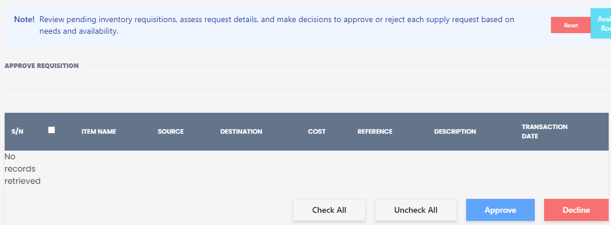

# Approve Requisition

**HEMS - Hotel Manager**

## Approve Requisition Page

The **Approve Requisition** page allows users to review pending inventory requisitions, assess request details, and make decisions to approve or reject each supply request based on needs and availability.

## Features

- **Reset Button**: Clears any filters or selections made on the page.
- **Approve Requisition Button**: Initiates the approval process for the selected requisitions.

## Requisition Table

The table displays the following columns:

- **S/N**: Serial number of the requisition.
- **Item Name**: Name of the item requested.
- **Source**: Origin of the requisition.
- **Destination**: Intended destination for the item.
- **Cost**: Cost of the item.
- **Reference**: Reference number or code for the requisition.
- **Description**: Brief description of the item or requisition.
- **Transaction Date**: Date when the requisition was made.

## Action Buttons

- **Check All**: Selects all entries in the list.
- **Uncheck All**: Deselects any selected entries.
- **Approve**: Approves the selected requisitions.
- **Decline**: Declines the selected requisitions.

## Usage

1. **Review Requisitions**: Check the table for pending requisitions, including item names, sources, destinations, costs, references, descriptions, and transaction dates.
2. **Select Requisitions**: Use the "Check All" or manually select individual requisitions to approve or decline.
3. **Approve or Decline**: Click the "Approve" button to approve the selected requisitions or the "Decline" button to reject them.

This page is essential for managing and processing requisition requests efficiently within the hotel management system.
