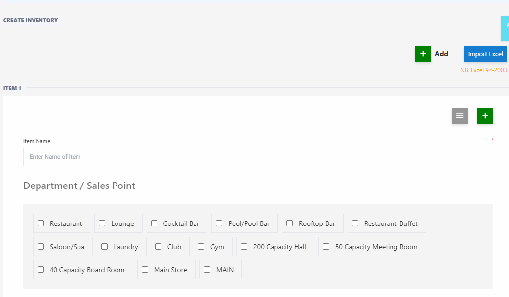

# Create Inventory

**HEMS - Hotel Manager**

# Create Inventory Page

The Create Inventory Page allows users to add new items to the inventory system. This page is essential for managing stock levels, tracking items, and ensuring that the inventory is up-to-date. Below are the key components and functionalities of this page:

## Form Fields
- **Item Name**: The name of the inventory item.
- **Item Code**: A unique code assigned to the item for identification.
- **Category**: Dropdown menu to select the category the item belongs to (e.g., Electronics, Furniture, Stationery).
- **Quantity**: The number of units available for the item.
- **Unit Price**: The price per unit of the item.
- **Supplier**: The name of the supplier providing the item.
- **Purchase Date**: The date when the item was purchased.
- **Expiry Date**: The date when the item will expire (if applicable).
- **Location**: The storage location of the item within the inventory.

## Buttons
- **Save**: Click to save the new inventory item to the system.
- **Cancel**: Click to discard the entry and return to the previous page.

## Example Entry
- **Item Name**: Office Chair
- **Item Code**: OC123
- **Category**: Furniture
- **Quantity**: 50
- **Unit Price**: $75.00
- **Supplier**: ABC Furniture Supplies
- **Purchase Date**: 2024-08-01
- **Expiry Date**: N/A
- **Location**: Warehouse A

## Additional Features
- **Validation**: Ensures that all required fields are filled out correctly before saving.
- **Notifications**: Provides feedback to the user upon successful creation or if there are errors that need to be addressed.

This page is designed to streamline the process of adding new items to the inventory, making it easy for users to manage and track their stock efficiently.
