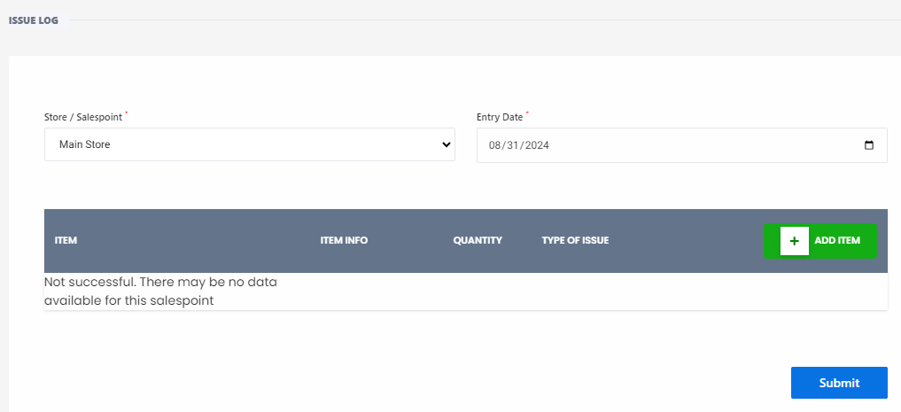

# Issue Log

**HEMS - Hotel Manager**

# Issue Log Page

The **Issue Log** page allows users to log and track issues related to items at a specific store or salespoint. This page is essential for maintaining accurate records of problems and ensuring timely resolution.

## Features

- **Store / Salespoint Dropdown**: Users can select the store or salespoint from a dropdown menu. The current selection is "Main Store."
- **Entry Date**: Displays the date when the issue is logged. The current date is "08/31/2024."

## Issue Table

The table displays the following columns:

- **ITEM**: Name of the item with an issue.
- **ITEM INFO**: Additional information about the item.
- **QUANTITY**: Number of units affected by the issue.
- **TYPE OF ISSUE**: Category of the issue (e.g., broken, expired, fake, stolen).

## Actions

- **+ ADD ITEM Button**: Allows users to add a new item to the issue log.
- **Submit Button**: Submits the logged issues for processing.

## Usage

1. **Select Store / Salespoint**: Choose the relevant store or salespoint from the dropdown menu.
2. **Log Issues**: Enter the details of the items with issues, including item name, item info, quantity, and type of issue.
3. **Add Items**: Click the "+ ADD ITEM" button to add the item to the log.
4. **Submit**: Click the "Submit" button to save the logged issues.

## Error Handling

- If there are no data available for the selected salespoint, a message will be displayed: "Not successful. There may be no data available for this salespoint."

This page is crucial for tracking and managing issues efficiently within the hotel management system.
