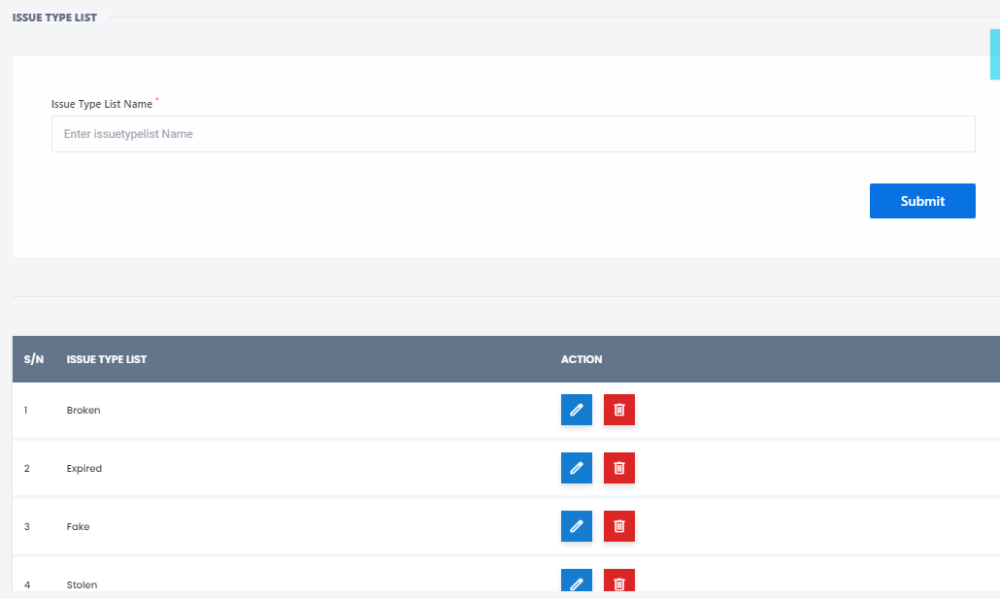

# Issue List Type

**HEMS - Hotel Manager**

# Issue Type List Page

The **Issue Type List** page allows users to manage different types of issues that can be tracked within the system. This page is essential for categorizing and organizing various issues for better management and resolution.

## Features

- **Issue Type Input**: Users can add new issue types by entering the name of the issue type in the input field labeled "Enter Issue/Type Name" and clicking the "Submit" button.

## Issue Type Table

The table displays the following columns:

- **S/N**: Serial number of the issue type.
- **Issue Type**: Name of the issue type.
- **Action**: Actions that can be performed on each issue type, including:
  - **Edit**: Modify the details of the issue type (represented by a pencil icon).
  - **Delete**: Remove the issue type from the list (represented by a trash bin icon).
  - **View**: View details of the issue type (represented by an eye icon).

## Current Issue Types

The table lists the following issue types:

1. **Broken**: Items that are damaged or not functioning.
2. **Expired**: Items that have passed their expiration date.
3. **Fake**: Items that are counterfeit or not genuine.
4. **Stolen**: Items that have been reported as stolen.

## Usage

1. **Add New Issue Type**: Enter the name of the new issue type in the input field and click "Submit" to add it to the list.
2. **Manage Issue Types**: Use the action buttons to edit, delete, or view details of existing issue types.

This page is crucial for maintaining an organized and efficient issue tracking system within the hotel management software.
