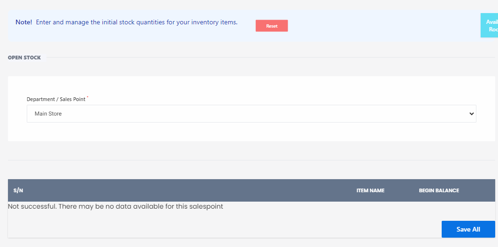

# Opening Stock

**HEMS - Hotel Manager**

# Opening Stock

The **Opening Stock** page allows you to enter and manage the initial stock quantities for your inventory items. This is essential for keeping track of your inventory from the start.

## Features

- **Department/Sale Point Dropdown**: Select the department or sales point for which you want to manage the stock.
- **Main Store Dropdown**: Choose the main store where the inventory is located.
- **Stock Table**: Displays the list of items with columns for:
  - **S/N**: Serial Number of the item.
  - **Item Name**: Name of the inventory item.
  - **Begin Balance**: Initial quantity of the item in stock.

## Instructions

1. **Select Department/Sale Point**: Use the dropdown to choose the relevant department or sales point.
2. **Select Main Store**: Choose the main store from the dropdown.
3. **Enter Initial Stock Quantities**: Input the beginning balance for each item in the table.
4. **Save or Reset**:
   - Click **Save All** to save the entered data.
   - Click **Reset** to clear all current entries.

## Notes

- If there is no data available for the selected sales point, a message will be displayed: "Not successful! There may be no data available for this salespoint."
- Ensure that all required fields are filled out correctly before saving.

## Buttons

- **Reset**: Clears all current entries on the page.
- **Save All**: Saves the entered data.

This page is crucial for setting up your inventory management system by establishing the initial stock levels for accurate tracking and management.
