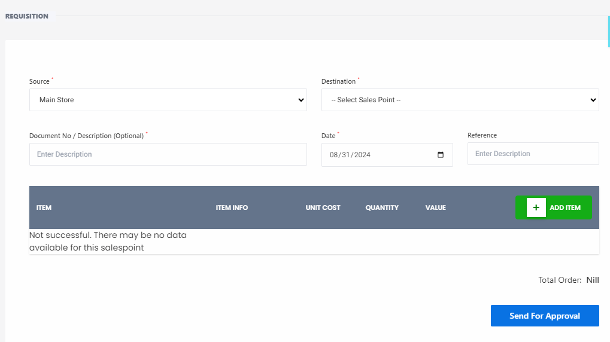

# Requisition

**HEMS - Hotel Manager**

# Requisition

**Note:** Please enter your current password and choose a new password below.

---

## Fields:

- **Current Password**: `Enter Current Password`
- **New Password**: `Enter New Password`
- **Confirm Password**: `Confirm New Password`

---

Submit | Reset
# Requisition

The **Requisition** page allows you to request items from one location to another within your organization. This page is essential for managing internal stock transfers and ensuring that all departments have the necessary inventory.

## Features

- **Source Dropdown**: Select the source location (e.g., Main Store) from which the items will be requisitioned.
- **Destination Dropdown**: Choose the destination sales point where the items will be sent.
- **Document No/Description**: Optionally enter a document number or description for the requisition.
- **Date Field**: Specify the date of the requisition.
- **Reference Field**: Optionally enter a reference for the requisition.

## Requisition Table

The table displays the list of items to be requisitioned with columns for:
  - **Item**: Name of the inventory item.
  - **Item No**: Item number or code.
  - **Unit Cost**: Cost per unit of the item.
  - **Quantity**: Number of units to be requisitioned.
  - **Value**: Total value of the requisitioned items.

## Instructions

1. **Select Source**: Use the dropdown to choose the source location (e.g., Main Store).
2. **Select Destination**: Choose the destination sales point from the dropdown.
3. **Enter Document Details**: Optionally fill in the document number/description and reference fields.
4. **Add Items**:
   - Click **+ ADD ITEM** to add items to the requisition table.
   - Fill in the item details including item name, item number, unit cost, quantity, and value.
5. **Send for Approval**: Once all items are added, click **Send For Approval** to submit the requisition for approval.

## Notes

- If there is no data available for the selected sales point, a message will be displayed: "Not successful. There may be no data available for this salespoint."
- Ensure that all required fields are filled out correctly before sending the requisition for approval.

## Buttons

- **+ ADD ITEM**: Adds a new item to the requisition table.
- **Send For Approval**: Submits the requisition for approval.

This page is crucial for managing internal stock transfers efficiently, ensuring that all departments have the necessary inventory to operate smoothly.
