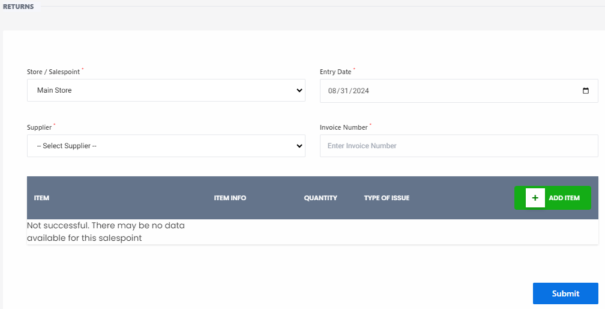

# Return Item

**HEMS - Hotel Manager**

# Return Item

The **Return Item** feature allows users to manage the return of items to suppliers. This is useful for handling defective, excess, or incorrect items. Below are the steps and fields involved in the return process:

## Fields and Options

- **Store / Salespoint**: Select the store or sales point from which the items are being returned. Example: `Main Store`.
- **Entry Date**: The date when the return entry is made. Example: `08/31/2024`.
- **Supplier**: Choose the supplier to whom the items are being returned. Example: `- Select Supplier -`.
- **Invoice Number**: Enter the invoice number associated with the items being returned. Example: `Enter Invoice Number`.

## Adding Items to Return

1. **ITEM**: Select the item to be returned.
2. **ITEM INFO**: Provide additional information about the item.
3. **QUANTITY**: Specify the quantity of the item being returned.
4. **TYPE OF ISSUE**: Indicate the reason for the return (e.g., defective, excess, incorrect).

Click the **+ ADD ITEM** button to add more items to the return list.

## Error Handling

If there is an issue with the data retrieval or entry process, an error message will be displayed. Example: `Not successful. There may be no data available for this salespoint`.

## Submission

Once all items are added and details are filled in, click the **Submit** button to complete the return process.

---

This feature ensures that returns are tracked and managed efficiently, helping maintain accurate inventory records and improving supplier relations.
