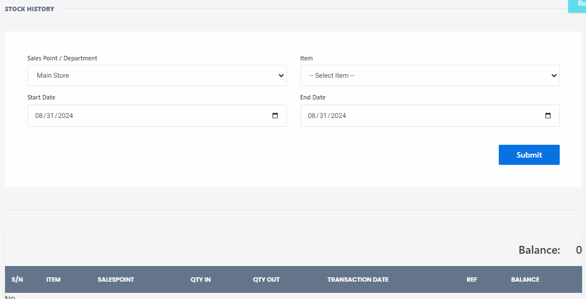

# Stock Ledger

**HEMS - Hotel Manager**

# Stock Ledger

The **Stock Ledger** feature provides a detailed history of inventory transactions, allowing users to track stock movements and maintain accurate inventory records. Below are the components and steps involved in using the stock ledger:

## Fields and Options

- **Sales Point / Department**: Select the sales point or department for which you want to view the stock history. Example: `Main Store`.
- **Item**: Choose the specific item for which you want to view the stock history. Example: `- Select Item -`.
- **Start Date**: Enter the start date for the period you want to review. Example: `08/31/2024`.
- **End Date**: Enter the end date for the period you want to review. Example: `08/31/2024`.

Click the **Submit** button to generate the stock history report based on the selected criteria.

## Stock History Table

The generated report will display a table with the following columns:

- **S/N**: Serial number of the transaction.
- **ITEM**: Name or description of the item.
- **SALESPOINT**: The sales point or department where the transaction occurred.
- **QTY IN**: Quantity of the item added to the stock.
- **QTY OUT**: Quantity of the item removed from the stock.
- **TRANSACTION DATE**: Date when the transaction occurred.
- **REF**: Reference number or identifier for the transaction.
- **BALANCE**: Current balance of the item in stock after the transaction.

## Balance

At the bottom of the table, the **Balance** field shows the total balance of the item in stock after all transactions within the specified date range.

---

This feature helps in maintaining transparency and accuracy in inventory management, ensuring that all stock movements are properly documented and easily accessible for review.
