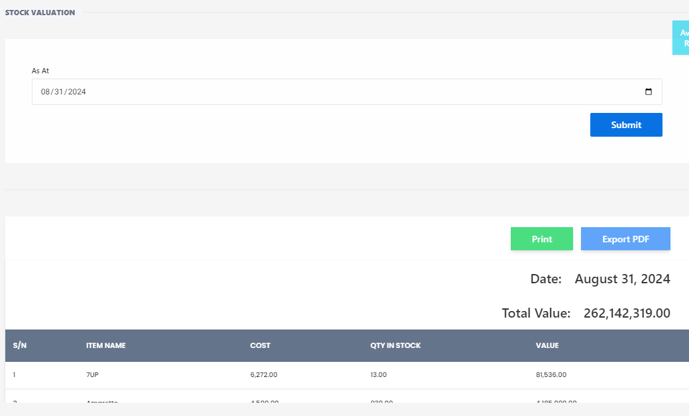

# Stock Valuation

**HEMS - Hotel Manager**

# Stock Valuation

The **Stock Valuation** feature provides an overview of the current value of inventory items. This is essential for financial reporting and inventory management. Below are the components and steps involved in using the stock valuation feature:

## Fields and Options

- **As At**: Select the date for which you want to view the stock valuation. Example: `08/31/2024`.

Click the **Submit** button to generate the stock valuation report based on the selected date.

## Stock Valuation Table

The generated report will display a table with the following columns:

- **S/N**: Serial number of the item.
- **ITEM NAME**: Name or description of the item.
- **COST**: Cost per unit of the item.
- **QTY IN STOCK**: Quantity of the item currently in stock.
- **VALUE**: Total value of the item in stock, calculated as `Cost x Quantity in Stock`.

### Example

| S/N | ITEM NAME | COST     | QTY IN STOCK | VALUE      |
|-----|-----------|----------|--------------|------------|
| 1   | 7UP       | ₹6,272.00| 13           | ₹81,536.00 |

## Total Value

At the bottom of the table, the **Total Value** field shows the cumulative value of all items in stock as of the selected date. Example: `₹262,142,319.00`.

## Additional Options

- **Print**: Click this button to print the stock valuation report.
- **Export PDF**: Click this button to export the stock valuation report as a PDF file.

---

This feature helps in maintaining accurate financial records and provides a clear picture of the inventory's worth at any given time.
