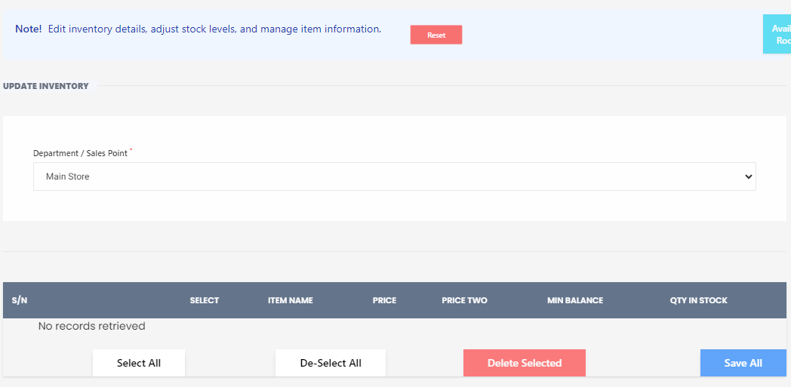

# Update Inevtory

**HEMS - Hotel Manager**

# Change Password

**Note:** Please enter your current password and choose a new password below.

---

## Fields:

- **Current Password**: `Enter Current Password`
- **New Password**: `Enter New Password`
- **Confirm Password**: `Confirm New Password`

---

Submit | Reset
# Update Inventory

The **Update Inventory** page allows you to edit inventory details, adjust stock levels, and manage item information efficiently.

## Features

- **Department/Sales Point Dropdown**: Select the department or sales point for which you want to update the inventory.
- **Main Store Dropdown**: Choose the main store where the inventory is located.
- **Inventory Table**: Displays the list of items with columns for:
  - **S/N**: Serial Number of the item.
  - **Select**: Checkbox to select items for bulk actions.
  - **Item Name**: Name of the inventory item.
  - **Price**: Current price of the item.
  - **Price Two**: Secondary price, if applicable.
  - **Min Balance**: Minimum balance required for the item.
  - **Qty in Stock**: Current quantity of the item in stock.

## Instructions

1. **Select Department/Sales Point**: Use the dropdown to choose the relevant department or sales point.
2. **Select Main Store**: Choose the main store from the dropdown.
3. **Edit Inventory Details**: Update the necessary fields in the table for each item.
4. **Bulk Actions**:
   - **Select All**: Select all items in the table.
   - **De-Select All**: Deselect all items.
   - **Delete Selected**: Remove selected items from the inventory list.
5. **Save Changes**: Click **Save All** to save any changes made to the inventory.

## Notes

- If there are no records retrieved for the selected department or store, a message will be displayed: "No records retrieved."
- Ensure that all required fields are filled out correctly before saving.

## Buttons

- **Select All**: Selects all items in the inventory table.
- **De-Select All**: Deselects all currently selected items.
- **Delete Selected**: Deletes the selected items from the inventory.
- **Save All**: Saves all changes made to the inventory.

This page is essential for maintaining accurate and up-to-date inventory records, ensuring that stock levels and item details are always current.
