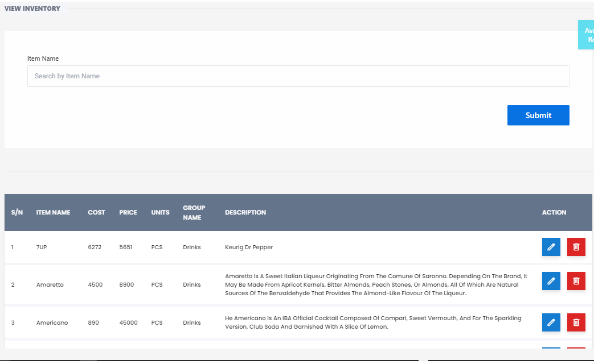

# View Inventory

**HEMS - Hotel Manager**

# View Inventory

The **View Inventory** page allows you to view and manage the details of your inventory items. This page provides a comprehensive overview of all items in your inventory, including their prices, group names, and descriptions.

## Features

- **Navigation Bar**: Includes options such as 'Home', 'Add Product', 'View Inventory', and more for easy navigation.
- **Search Field**: Allows you to search for specific inventory items by their name.
- **Inventory Table**: Displays the list of items with columns for:
  - **S/N**: Serial Number of the item.
  - **Item Name**: Name of the inventory item.
  - **Cost Price**: The cost price of the item.
  - **Sales Price**: The sales price of the item.
  - **Group Name**: The category or group to which the item belongs.
  - **Description**: A brief description of the item.
  - **Action**: Icons for editing or deleting the item.

## Instructions

1. **Search for Items**: Use the search field labeled "Item Name" to find specific items in your inventory.
2. **View Item Details**: The table displays all relevant details for each item, including cost price, sales price, group name, and description.
3. **Sort Items**: Click on the column headers to sort the items based on the selected column (e.g., Item Name, Cost Price).
4. **Edit or Delete Items**: Use the action icons in the 'Action' column to edit or delete items as needed.

## Notes

- Ensure that the search field is used correctly to find specific items quickly.
- Sorting the table can help in organizing and finding items more efficiently.
- Regularly update the inventory details to maintain accurate records.

## Buttons

- **Submit**: Click this button after entering an item name in the search field to find the specific item.

This page is essential for keeping track of all inventory items, ensuring that you have a clear and organized view of your stock at all times.
