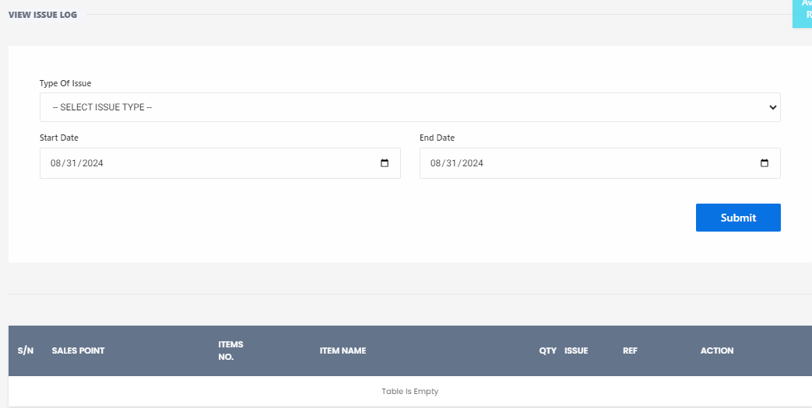

# View Issue Log

**HEMS - Hotel Manager**

# View Issue Log

The **View Issue Log** page allows users to track and manage issues related to inventory or sales over a specified period. This page includes the following features:

## Filters

- **Type of Issue**: A dropdown menu to select the type of issue you want to view. Options might include various issue categories relevant to your system.
- **Start Date**: A date picker to select the beginning date for the issue log.
- **End Date**: A date picker to select the ending date for the issue log.
- **Submit Button**: After selecting the filters, click the "Submit" button to view the filtered issue logs.

## Issue Log Table

The table displays the filtered issue logs with the following columns:

- **S/N**: Serial Number of the issue.
- **Sales Point**: The location or point of sale where the issue occurred.
- **Teller No.**: The identifier for the teller or cashier involved.
- **Item Name**: The name of the item related to the issue.
- **Qty Issue**: The quantity of the item involved in the issue.
- **Ref**: Reference number or code for the issue.
- **Action**: Actions that can be taken to resolve the issue.

If no issues match the selected filters, the table will display "Table is Empty."

## Example Usage

1. Select the type of issue from the dropdown menu.
2. Choose the start and end dates for the period you want to review.
3. Click the "Submit" button to view the issue logs.

This page helps in efficiently managing and resolving issues by providing a clear and organized view of all logged issues.
