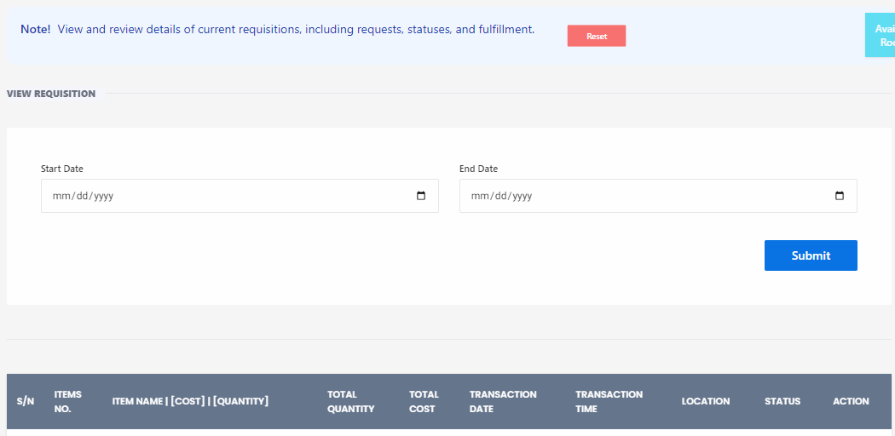

# View Requisition

**HEMS - Hotel Manager**

# View Requisition

# View Requisition Page

The **View Requisition** page allows users to view and review details of current requisitions, including requests, statuses, and fulfillment.

## Features

- **Date Filters**: Users can filter requisitions by selecting a start date and an end date using the date picker fields.
- **Submit Button**: After selecting the desired date range, users can click the "Submit" button to view the filtered requisitions.

## Requisition Table

The table displays the following columns:

- **S/N**: Serial number of the requisition.
- **Item Name**: Name of the item requested.
- **Cost (₹)**: Cost of a single unit of the item.
- **Quantity**: Number of units requested.
- **Total Cost**: Total cost calculated as `Cost × Quantity`.
- **Requisition Date**: Date when the requisition was made.
- **Transaction Time**: Time when the requisition was processed.
- **Location**: Location related to the requisition.
- **Status**: Current status of the requisition (e.g., pending, approved, fulfilled).
- **Action**: Additional actions that can be taken on the requisition, represented by three vertical dots.

## Usage

1. **Filter Requisitions**: Select the start and end dates to filter the requisitions you want to view.
2. **Submit**: Click the "Submit" button to apply the date filter.
3. **Review Details**: Check the table for detailed information about each requisition, including item names, costs, quantities, and statuses.

This page is essential for tracking and managing requisitions efficiently within the hotel management system.
