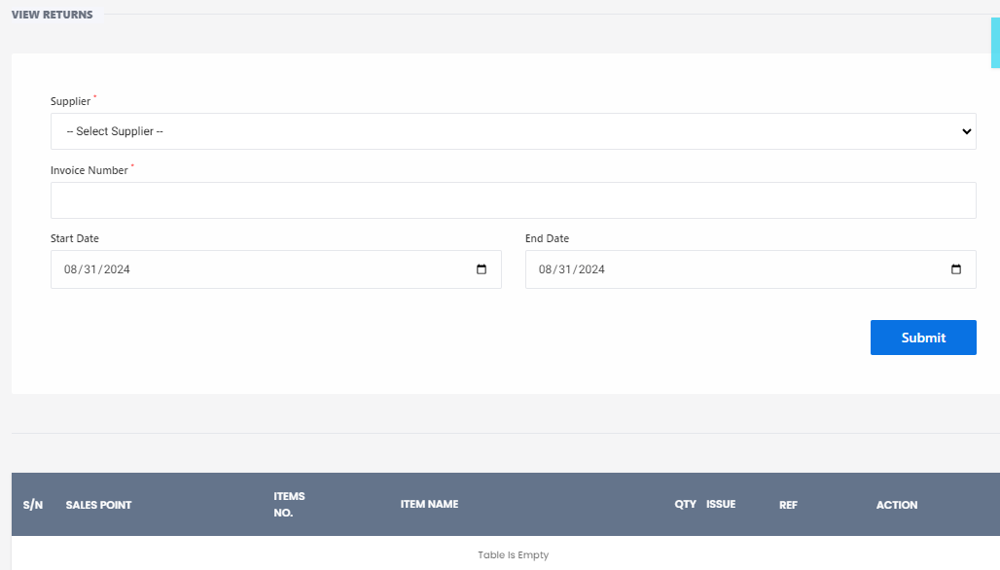

# View Return Item

**HEMS - Hotel Manager**

# View Return Item

The **View Return Item** feature allows users to review the details of items that have been returned. This is essential for tracking returns and ensuring accurate inventory management. Below are the components and steps involved in viewing return items:

## Fields and Options

- **Store / Salespoint**: Displays the store or sales point from which the items were returned. Example: `Main Store`.
- **Entry Date**: Shows the date when the return entry was made. Example: `08/31/2024`.
- **Supplier**: Indicates the supplier to whom the items were returned. Example: `- Select Supplier -`.
- **Invoice Number**: Displays the invoice number associated with the returned items. Example: `Enter Invoice Number`.

## Viewing Returned Items

1. **ITEM**: Lists the items that were returned.
2. **ITEM INFO**: Provides additional information about each returned item.
3. **QUANTITY**: Shows the quantity of each item that was returned.
4. **TYPE OF ISSUE**: Indicates the reason for the return (e.g., defective, excess, incorrect).

## Error Handling

If there is an issue with retrieving the return data, an error message will be displayed. Example: `Not successful. There may be no data available for this salespoint`.

---

This feature helps in maintaining transparency and accuracy in the return process, ensuring that all returned items are properly documented and managed.
