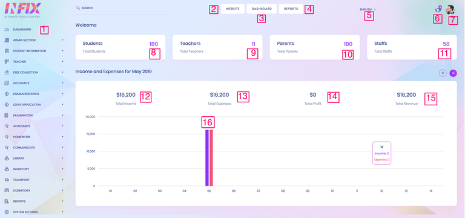
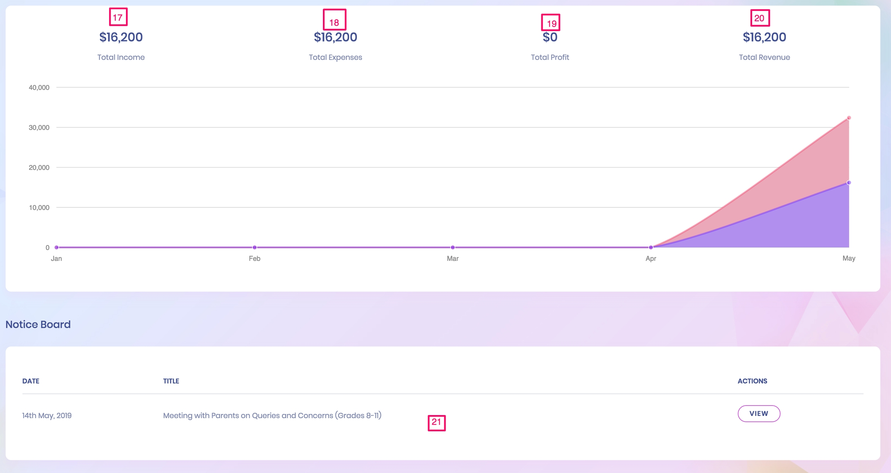
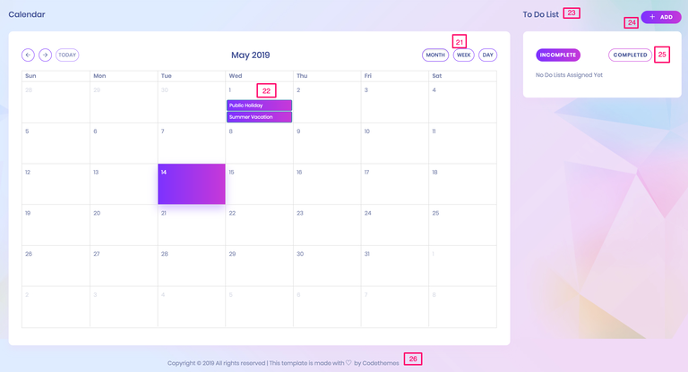

# HEMSEdu Dashboard

**1 & 3. Dashboard**
At the top menu of the left sidebar is the Dashboard. The dashboard provides an overview of the number of students, teachers, and staff. It also displays a summary of the income and expenses, which is crucial for an HEMS system. Upon logging in, users can view updates for the current day.

**2. Website**
Users can easily navigate back to their website's homepage from the dashboard.

**4. Reports**
The Reports section plays a vital role in this School Management HEMS. Users can access the report section from any part of the system.

**5. Language**
HEMS comes equipped with various languages: English, Arabic (RTL), French, Dutch, German, Hindi, Italian, Turkish, Russian, Spanish, and Portuguese. Users can also add their own language customizations.

**6. Notifications**
If administrators or teachers assign tasks to students, notifications are automatically sent to the respective teachers, students (all students or specific class students), and parents. Users can also track sent messages.

**7. Profile**
Users can view and edit their profiles, change their passwords, and log out using the options provided in this section.

**8. Number of Students**
Users can view the total number of students, manage their profiles, change passwords, and log out from this section.

**Dashboard**
At the top of the left sidebar is the Dashboard. It provides a comprehensive view of the number of students, teachers, and staff. Additionally, it highlights the income and expenses summary essential for the HEMS system. Users can stay updated with the latest information for the day upon logging in. 

Module: Dashboard
The Dashboard module serves as the central hub for quick access to vital information and functionalities within the system. It provides users with a comprehensive overview of key data points and actionable insights, all presented in an intuitive and easy-to-navigate interface. The dashboard is designed to enhance user experience by offering real-time updates, ensuring that users can make informed decisions quickly and efficiently.
Submodule: Population Info
Population Info offers a snapshot of the current population across various categories, including students, teachers, parents, and staff. This section is designed to give administrators a quick overview of the number of individuals associated with the institution, helping them monitor and manage these groups effectively. The data is dynamically updated, allowing for accurate, real-time reporting that can be crucial for planning and resource allocation.
Submodule: Financial Analysis
Financial Analysis provides an in-depth view of the institution's financial performance, focusing on income analysis on a monthly and yearly basis. This submodule includes charts and graphs that visualize income trends, allowing administrators to track financial health over time. The module is essential for budget planning, financial forecasting, and ensuring that the institution remains financially sustainable.
Submodule: Notice Board
The Notice Board submodule acts as a centralized location for all important announcements and communications. It allows administrators to post updates that can be instantly accessed by students, teachers, parents, and staff. This ensures that everyone remains informed about crucial events, changes, and other relevant information, fostering a well-connected community.
Submodule: Calendar
The Calendar submodule highlights important dates and events, providing users with a clear view of the institution's schedule. This includes academic deadlines, holidays, examination dates, and other significant events. The calendar is an essential tool for keeping all users organized and aware of upcoming activities, thereby reducing the chances of missed deadlines or unpreparedness.
Submodule: WhatsApp Support
WhatsApp Support offers a direct line to technical support via WhatsApp, ensuring that users can quickly resolve any issues they encounter. This feature is particularly useful for real-time problem-solving, providing a convenient and accessible way for users to get the help they need without having to leave the dashboard. The integration with WhatsApp streamlines communication, making it easier for users to receive assistance on the go.