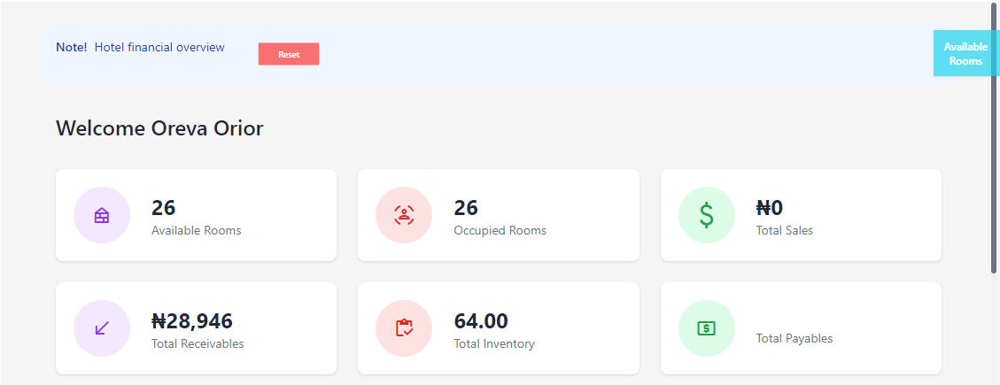
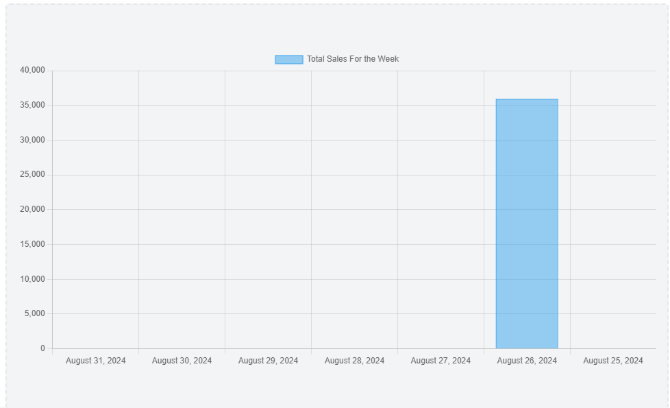

# Dashboard

**HEMS - Hotel Manager**

# Hotel Financial Overview Dashboard

Welcome to the Hotel Financial Overview Dashboard! This dashboard provides a comprehensive snapshot of the hotel's current financial status and room availability. Below is a detailed explanation of each section:

## Welcome Message
- **Welcome Oreva Orior**: A personalized greeting for the user.

## Room Availability
- **Available Rooms**: Displays the number of rooms currently available for booking. 
  - **Icon**: Bed icon.
  - **Count**: 26 rooms.

- **Occupied Rooms**: Shows the number of rooms currently occupied by guests.
  - **Icon**: People icon.
  - **Count**: 26 rooms.

## Financial Summary
- **Total Sales**: Indicates the total sales amount.
  - **Currency**: ₹ (Indian Rupee).
  - **Amount**: ₹0.

- **Total Receivables**: Represents the total amount receivable.
  - **Amount**: ₹28,946.
  - **Trend**: Upward trend arrow indicating an increase.

- **Total Payables**: Shows the total amount payable.
  - **Amount**: ₹64.00.

## Navigation
- **Available Rooms Button**: A button to view more details about the available rooms.

This dashboard is designed to provide key financial metrics and room availability at a glance, helping hotel management make informed decisions quickly and efficiently.

# Total Sales for the Week Dashboard

This dashboard provides a visual representation of the total sales for the week, allowing you to quickly assess performance and identify peak sales periods. Below is a detailed explanation of each section:

## Title
- **Total Sales for the Week**: The title of the dashboard, indicating that the chart represents sales data for a specific week.

## Bar Chart
- **X-Axis (Horizontal)**: Represents the dates from August 31, 2024, to September 6, 2024.
  - **Dates**: Each date corresponds to a day within the specified week.

- **Y-Axis (Vertical)**: Shows the numerical values in increments of 5,000, starting from 0 at the bottom and going up to 40,000 at the top.
  - **Values**: These values represent the total sales amount in dollars.

## Data Representation
- **Blue Bar**: The prominent blue bar corresponds to August 25, 2024, indicating total sales of approximately $35,000 on that day.
  - **Height of the Bar**: The height of the bar represents the sales amount, with higher bars indicating higher sales.

- **No Bars for Other Dates**: The absence of bars for the other dates suggests that there were no sales recorded on those days.

This dashboard is designed to provide a clear and concise overview of sales performance over the week, helping you to quickly identify trends and make informed decisions.
