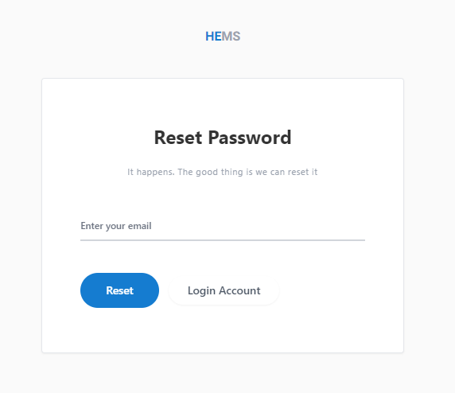

# Forgetpassword

**HEMS - Hotel Manager**

# Forgot Password Page

The **HEMS Hotel Management Software** provides a straightforward way to reset your password if you've forgotten it. This page allows users to initiate the password reset process.

## Page Overview

### Instructions
- The page includes a brief message: _"It happens. The good thing is we can reset it."_ This reassures users that the password reset process is simple and accessible.

### Fields

- **Enter your email**: Users are required to enter the email address associated with their HEMS account. This email is where the password reset instructions will be sent.

### Actions

- **Reset**: After entering the email address, click the `Reset` button. This will trigger the system to send a password reset email to the provided address. Follow the instructions in the email to reset your password.
- **Login Account**: If you remember your password, or if you decide not to reset it, you can click the `Login Account` button to return to the login page.

## Notes

- Ensure that the email entered is the one associated with your HEMS account to successfully receive the reset instructions.
- Check your spam or junk mail folder if you do not receive the reset email in your inbox.

---

This documentation provides an overview of the password reset process for users of the HEMS Hotel Management Software. If you encounter any issues during the process, please visit the Help & Support section or submit a support ticket for further assistance.
