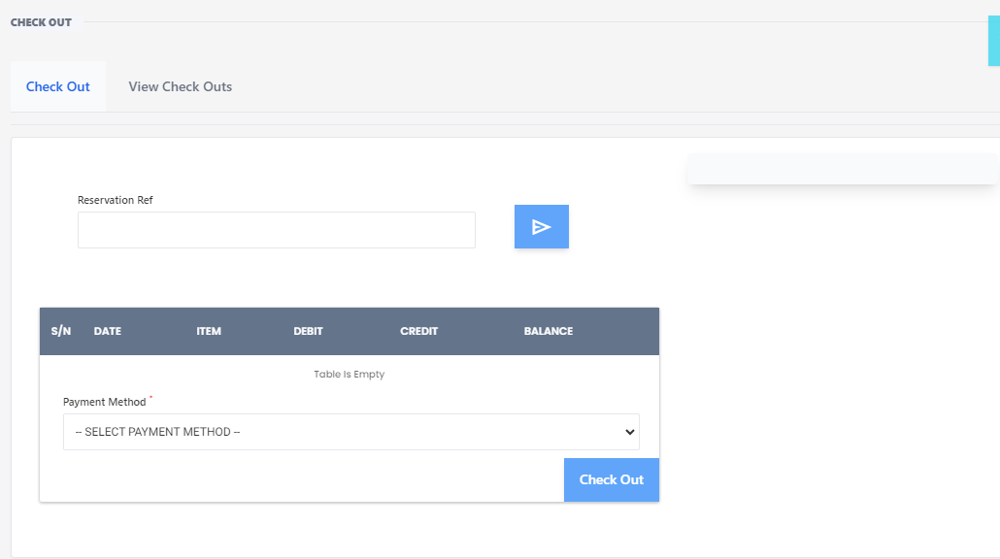

# Check Out

**HEMS - Hotel Manager**

## Check Out Page

The **Check Out** page is designed to facilitate the process of finalizing a guest's stay at the hotel. This page allows staff to manage and complete the check-out process efficiently.

## Features

- **Reservation Reference**: Enter the reservation reference number to retrieve the guest's booking details.
- **Transaction Table**: Displays a summary of all transactions associated with the reservation, including:
  - **S/N**: Serial number of the transaction.
  - **DATE**: Date of the transaction.
  - **ITEM**: Description of the transaction item.
  - **DEBIT**: Amount debited.
  - **CREDIT**: Amount credited.
  - **BALANCE**: Remaining balance after the transaction.
- **Payment Method**: Select the payment method from the dropdown menu to settle the balance.
- **Check Out Button**: Finalize the check-out process by clicking this button.

## How to Use

1. **Enter Reservation Reference**: Input the reservation reference number in the provided field and click the search button.
2. **Review Transactions**: Check the transaction table for all charges and payments related to the reservation.
3. **Select Payment Method**: Choose the appropriate payment method from the dropdown menu.
4. **Finalize Check Out**: Click the 'Check Out' button to complete the process.

## Notes

- Ensure all transactions are reviewed and correct before finalizing the check-out.
- The system will update the reservation status to 'Checked Out' once the process is completed.

By using the **Check Out** page, hotel staff can efficiently manage guest departures, ensuring a smooth and accurate check-out process.

# View Check Outs Page

The **View Check Outs** page allows hotel staff to review and manage all guest check-outs within a specified date range. This page provides a comprehensive overview of check-out details, making it easier to track and verify guest departures.

## Features

- **Date Range Selection**: Choose the start and end dates to filter check-out records.
- **Submit Button**: Click to retrieve check-out records for the selected date range.
- **Check Out Table**: Displays detailed information about each check-out, including:
  - **Action**: Available actions for each record.
  - **Room**: Room number associated with the check-out.
  - **Guest**: Name of the guest.
  - **# of Nights**: Number of nights the guest stayed.
  - **Total Rate**: Total amount charged for the stay.
  - **Reservation Type**: Type of reservation (e.g., standard, group).
  - **Arrival Date**: Date the guest checked in.
  - **Departure Date**: Date the guest checked out.
  - **Billing Info**: Billing information for the reservation.
  - **Payment Method**: Method used for payment.

## How to Use

1. **Select Date Range**: Use the date pickers to choose the start and end dates for the check-out records you want to view.
2. **Submit**: Click the 'Submit' button to retrieve the check-out records for the specified date range.
3. **Review Records**: Examine the details in the check-out table to verify and manage guest departures.

## Notes

- Ensure the date range covers the period you are interested in to get accurate records.
- Use the action buttons to perform tasks such as viewing detailed billing information or correcting any discrepancies.

By using the **View Check Outs** page, hotel staff can efficiently monitor and manage guest check-outs, ensuring a smooth and accurate process.
