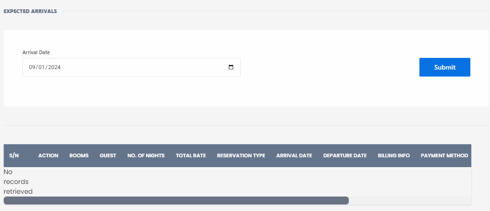

# Expected Arrivals

**HEMS - Hotel Manager**

## Expected Arrivals Page

The **Expected Arrivals** page is designed to help hotel staff manage and track upcoming guest arrivals. This page provides a comprehensive overview of all reservations scheduled to arrive on a specific date.

## Features

- **Arrival Date**: Select the date for which you want to view the expected arrivals. Use the date picker to choose the desired date.
- **Submit Button**: Click to apply the selected date and retrieve the list of expected arrivals.

## Table Columns

- **S/N**: Serial number of the reservation.
- **Action**: Options to manage the reservation, such as editing or viewing details.
- **Rooms**: The number of rooms booked.
- **Guest**: The name of the guest.
- **# of Nights**: The number of nights the guest will stay.
- **Total Reservation Fee**: The total fee for the reservation.
- **Arrival Date**: The date of arrival.
- **Departure Date**: The date of departure.
- **Billing Info**: Information related to billing.
- **Payment Method**: The method of payment used for the reservation.

## Usage

1. **Select Arrival Date**: Use the date picker to select the date for which you want to view the expected arrivals.
2. **Submit**: Click the "Submit" button to retrieve the list of reservations for the selected date.
3. **View Reservations**: The table will display all reservations scheduled to arrive on the selected date. If no records are found, a message indicating "No records retrieved" will be shown.

This page ensures that hotel staff can efficiently manage and prepare for guest arrivals, providing a smooth check-in experience.
