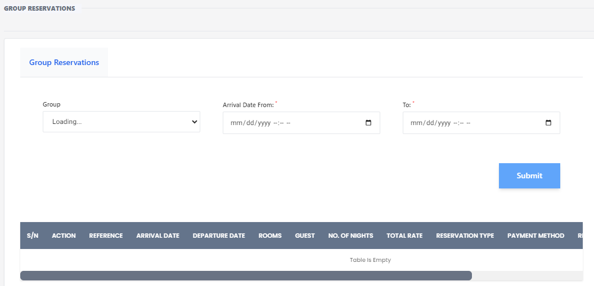

# Group Reservation

**HEMS - Hotel Manager**

## Group Reservations

The group reservation feature allows you to manage bookings for multiple guests under a single reservation. This is particularly useful for events, corporate bookings, or large family gatherings. Here's how to use the group reservation page:

## Steps to Create a Group Reservation

1. **Navigate to the Group Reservations Page**
   - Go to the main menu and select the "Group Reservations" option.

2. **Enter Group Details**
   - **Group Name**: Enter the name of the group making the reservation. This field may take a moment to load.
   - **Arrival Date**: Specify the arrival date for the group. Use the format `mm/dd/yyyy`.
   - **Departure Date**: Specify the departure date for the group. Use the format `mm/dd/yyyy`.

3. **Submit the Reservation**
   - Once all the details are filled in, click the "Submit" button to save the group reservation.

## Viewing and Managing Group Reservations

Below the input fields, there is a table that displays all group reservations. The table includes the following columns:

- **S/N**: Serial number of the reservation.
- **Action**: Actions you can take on the reservation (e.g., edit, delete).
- **Reference**: Unique reference number for the reservation.
- **Arrival Date**: Date of arrival for the group.
- **Departure Date**: Date of departure for the group.
- **Rooms**: Number of rooms booked.
- **Guest No.**: Number of guests in the group.
- **No. of Nights**: Total number of nights for the stay.
- **Total Rate**: Total cost of the reservation.
- **Reservation Payment**: Payment status of the reservation.
- **Payment Method**: Method used for payment.

If no data is available, the table will display the message "No data available in table."

## Additional Features

- **Filter Options**: Use the date fields to filter reservations by arrival and departure dates.
- **Action Buttons**: Use the action buttons to edit or delete existing reservations.
- **Detailed View**: Click on a reservation to view more detailed information about the group's stay.

By following these steps, you can efficiently manage group reservations, ensuring a smooth booking process for large parties.
