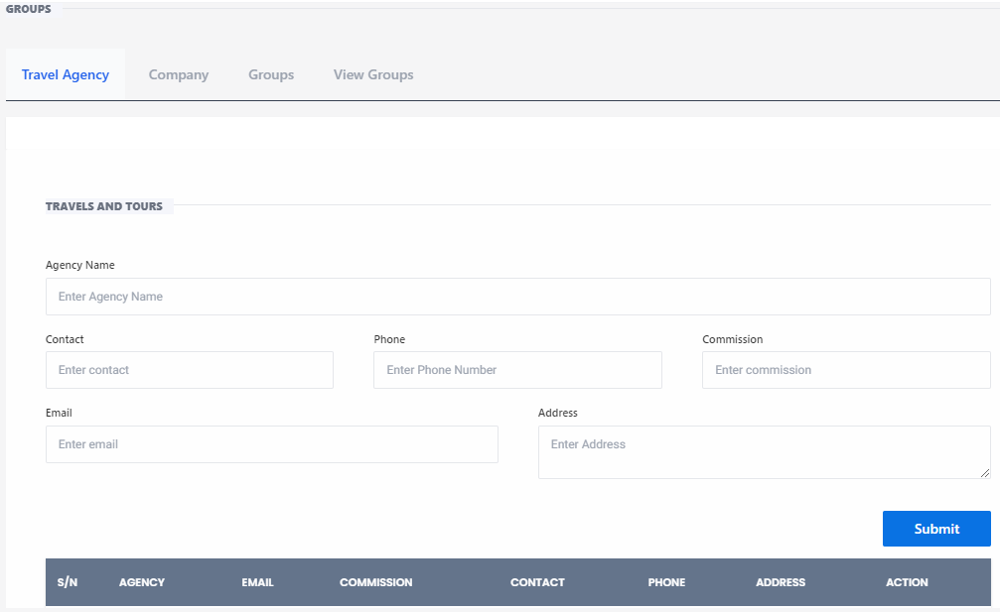

# Groups

**HEMS - Hotel Manager**

## Groups

The **Groups** page is designed to manage and organize various groups within the hotel management system. This page allows staff to create, view, and manage groups, including travel agencies, companies, and guest groups.

## Features

### Tabs
- **Travel Agency**: Manage travel agencies associated with the hotel.
- **Company**: Manage company accounts and their associated bookings.
- **Groups**: Create and manage guest groups.
- **View Groups**: View details of existing groups.

### Form Fields
- **Agency Name**: Enter the name of the travel agency.
- **Contact**: Enter the contact person's name.
- **Email**: Enter the contact email address.
- **Phone Number**: Enter the contact phone number.
- **Commission**: Enter the commission rate for the agency.
- **Address**: Enter the agency's address.

### Buttons
- **Submit**: Submit the form to save the group details.
- **Print**: Print the group information.
- **Export PDF**: Export the group information as a PDF document.
- **Export Excel**: Export the group information as an Excel spreadsheet.

### Table
- **S/N**: Serial number of the group.
- **Agency**: Name of the agency.
- **Email**: Contact email of the agency.
- **Commission**: Commission rate for the agency.
- **Contact**: Contact person's name.
- **Phone**: Contact phone number.
- **Address**: Address of the agency.
- **Action**: Actions that can be performed on the group record.

## Usage
1. **Select Tab**: Choose the appropriate tab to manage travel agencies, companies, or guest groups.
2. **Enter Details**: Fill in the required information in the form fields.
3. **Submit Form**: Click the 'Submit' button to save the group details.
4. **Export Data**: Use the export options to print or download group information in PDF or Excel format.
5. **Review Groups**: Check the table for detailed group information and perform any necessary actions.

This page helps streamline the management of various groups, making it easier for hotel staff to handle bookings and special requests efficiently.
