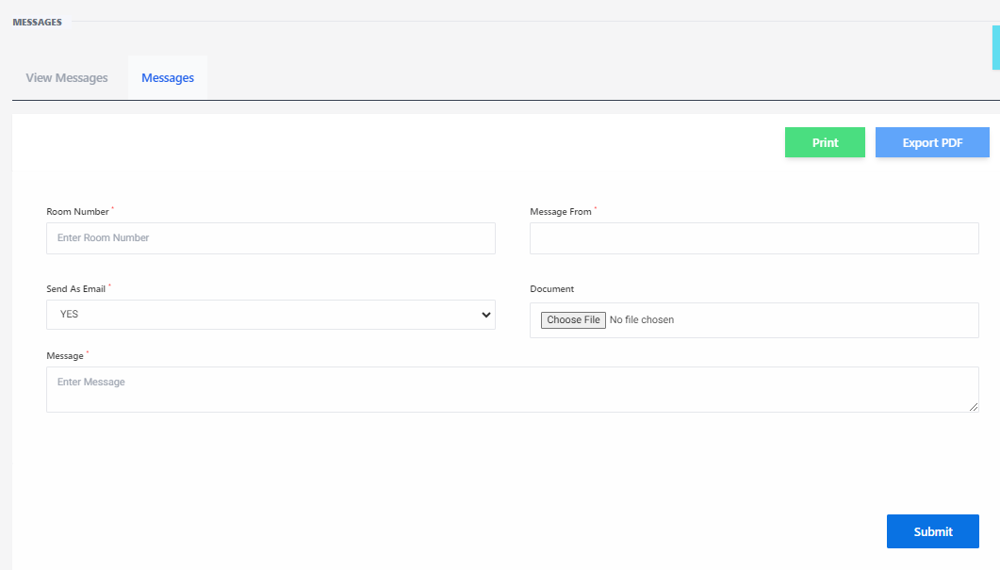

# Messages

**HEMS - Hotel Manager**

## Messages

The **Messages** page allows hotel staff to communicate efficiently with guests and other staff members. This page includes features for sending messages, attaching documents, and exporting conversations.

## Overview

- **Room Number**: Enter the room number to specify the recipient of the message.
- **Message From**: Indicates the sender of the message.
- **Send As Email**: Option to send the message as an email.
- **Document**: Attach a document to the message.
- **Enter Message**: Type the message content here.
- **Print**: Print the current message or conversation.
- **Export PDF**: Export the message or conversation as a PDF file.
- **Submit**: Send the message.

## Steps to Use the Messages Page

1. **Enter Room Number**: Input the room number of the guest you want to message.
2. **Select Message From**: Choose the sender from the dropdown menu.
3. **Send As Email**: (Optional) Select this option if you want to send the message as an email.
4. **Attach Document**: (Optional) Click "Choose File" to attach a document to the message.
5. **Enter Message**: Type your message in the "Enter Message" text box.
6. **Print or Export**: Use the "Print" or "Export PDF" buttons to print or save the message.
7. **Submit**: Click the "Submit" button to send the message.

## Example

| Field            | Description                                      |
|------------------|--------------------------------------------------|
| Room Number      | 101                                              |
| Message From     | Front Desk                                       |
| Send As Email    | Yes                                              |
| Document         | No file chosen                                   |
| Enter Message    | "Dear Guest, your room service request is on the way." |
| Print            | [Print Button]                                   |
| Export PDF       | [Export PDF Button]                              |
| Submit           | [Submit Button]                                  |

## Important Notes

- Ensure the room number is correct to avoid sending messages to the wrong recipient.
- Use the "Send As Email" option for important messages that need to be documented.
- Attach relevant documents if necessary, such as invoices or itineraries.
- Use the "Print" and "Export PDF" options for record-keeping.

By using the **Messages** page, hotel staff can maintain clear and efficient communication with guests, enhancing the overall guest experience.

# View Messages

The **View Messages** page allows hotel staff to review and manage all messages sent to and from guests. This page provides a comprehensive overview of message details, including status and actions required.

## Overview

- **Export Excel**: Button to export the messages list to an Excel file for record-keeping or further analysis.

## Messages Table

The table displays the following columns:

- **S/N**: Serial number of the message.
- **Room Number**: The room number associated with the message.
- **Message**: The content of the message.
- **Message From**: Indicates the sender of the message.
- **Send as Email**: Shows whether the message was sent as an email.
- **Message Status**: The current status of the message (e.g., Pending, Delivered).
- **Sent At**: The date and time when the message was sent.
- **Action**: Options to edit, resend, or delete the message.

## Example

| S/N | Room Number | Message                                      | Message From | Send as Email | Message Status | Sent At                  | Action |
|-----|-------------|----------------------------------------------|--------------|---------------|----------------|--------------------------|--------|
| 1   | 6           | Please This Customer Is At An Event          | Front Desk   | YES           | Pending        | Jan 14th, 2020 at 2:04 pm| [Edit] [Resend] [Delete] |
| 2   | 752         | This Is The End Of The Message               | Front Desk   | YES           | Delivered      | May 12th, 2020 at 4:05 pm| [Edit] [Resend] [Delete] |

## Actions

- **Edit**: Modify the content of the message.
- **Resend**: Send the message again.
- **Delete**: Remove the message from the list.

## Steps to Use the View Messages Page

1. **Review Messages**: Check the table for all messages, their statuses, and details.
2. **Export Messages**: Click the "Export Excel" button to download the messages list as an Excel file.
3. **Perform Actions**: Use the action buttons to edit, resend, or delete messages as needed.

## Important Notes

- Regularly check the message statuses to ensure all communications are delivered.
- Use the "Export Excel" feature for maintaining records or conducting further analysis.
- Ensure that sensitive information is handled appropriately when editing or resending messages.

By using the **View Messages** page, hotel staff can efficiently manage guest communications, ensuring timely and accurate responses.
