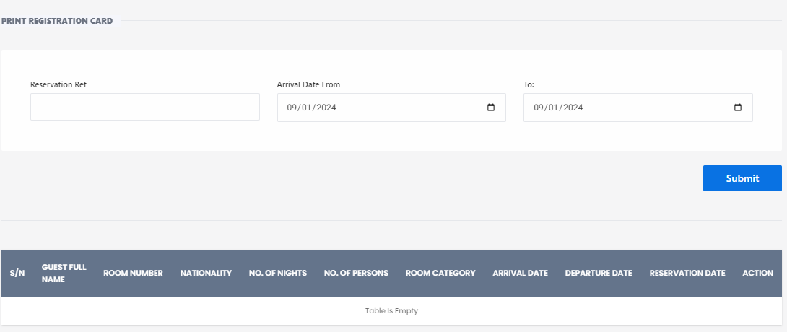

# Print Registration Card

**HEMS - Hotel Manager**

## Print Registration Card Page

The **Print Registration Card** page allows hotel staff to generate and print registration cards for guests. This page is essential for managing guest check-ins and ensuring all necessary information is documented.

## Features

- **Reservation Reference**: Input the reservation reference number to filter specific bookings.
- **Arrival Date From**: Select the start date for the arrival period.
- **To**: Select the end date for the arrival period.
- **Submit Button**: Click to apply the filters and display the relevant reservations.

## Table Columns

- **S/N**: Serial number of the reservation.
- **Guest Full Name**: The full name of the guest.
- **Room Number**: The assigned room number.
- **Nationality**: The nationality of the guest.
- **No. of Persons**: The number of persons included in the reservation.
- **Room Category**: The category of the room booked.
- **Arrival Date**: The date of arrival.
- **Departure Date**: The date of departure.
- **Reservation Date**: The date when the reservation was made.
- **Action**: Options to manage the reservation.

## Usage

1. **Filter Reservations**: Use the date selectors and reservation reference to filter the reservations you want to print.
2. **View Reservations**: The filtered reservations will be displayed in the table below.
3. **Print Registration Cards**: Select the reservations and use the print functionality to generate registration cards for the guests.

This page ensures that all guest information is accurately captured and easily accessible for printing registration cards.
