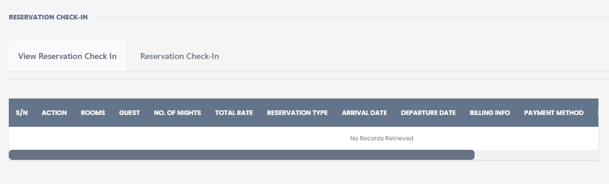
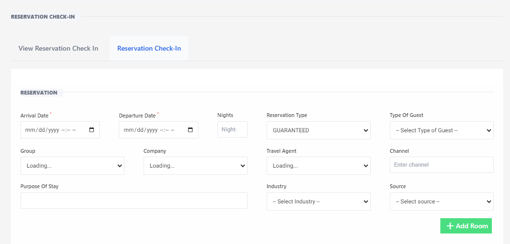

# Rservation Checkin

**HEMS - Hotel Manager**

# View Reservation Check-In

The "View Reservation Check-In" page allows hotel staff to efficiently manage the check-in process for guests. This page provides detailed information about reservations, including room assignments, guest details, and billing information.

## Features

### Reservations Table
Displays a list of reservations with detailed information for the check-in process.

The table includes the following columns:
- **S/N:** Serial number of the reservation.
- **Action:** Actions that can be performed on the reservation (e.g., check-in, edit, delete).
- **Rooms:** Room number(s) assigned to the reservation.
- **Guest:** Name of the guest.
- **No. of Nights:** Number of nights the guest will stay.
- **Total Rate:** Total cost of the reservation.
- **Reservation Type:** Type of reservation (e.g., online, walk-in).
- **Arrival Date:** Check-in date.
- **Departure Date:** Check-out date.
- **Billing Info:** Billing information for the reservation.
- **Payment Method:** Method of payment used by the guest.

### No Records Retrieved
Indicates when no reservations match the selected criteria or no reservations are available for check-in.

If no reservations are available for check-in, a message will be displayed: "No Records Retrieved".

## Usage

1. **View Reservations:** The table will display all reservations that are available for check-in.
2. **Perform Actions:** Use the action buttons in the table to check-in guests, edit reservation details, or delete reservations as needed.

## Notes
- Ensure that all guest details are accurate before performing the check-in.
- Use the action buttons to manage reservations efficiently and ensure a smooth check-in process for guests.

---

This documentation should help users understand and utilize the "Reservation Check-In" page effectively. If you need further details or additional sections, feel free to ask!

## Reservation Check-In

The "Reservation Check-In" page allows hotel staff to view and manage guest reservations efficiently. This page provides detailed information about reservations, including arrival and departure dates, number of nights, reservation type, and guest details.

## Features

### Reservation Details
Displays fields to input and view reservation details.

- **Arrival Date:** The date the guest is scheduled to check in.
- **Departure Date:** The date the guest is scheduled to check out.
- **Nights:** The number of nights the guest will stay.
- **Reservation Type:** The type of reservation (e.g., guaranteed, tentative).
- **Type of Guest:** The category of the guest (e.g., individual, group).
- **Group:** The group name if the reservation is part of a group booking.
- **Company:** The company name if the reservation is made through a corporate account.
- **Travel Agent:** The travel agent handling the reservation.
- **Channel:** The booking channel used (e.g., online, direct).
- **Purpose of Stay:** The reason for the guest's stay.
- **Industry:** The industry associated with the guest or booking.
- **Source:** The source of the booking.

### Actions
Provides options to manage reservations.

- **View Reservation:** Allows staff to view detailed information about the reservation.
- **Reservation Check-In:** Initiates the check-in process for the guest.
- **+ Add Room:** Adds additional rooms to the reservation if needed.

## Usage

1. **Input Reservation Details:** Enter the required information in the fields provided.
2. **View Reservation:** Click the "View Reservation" button to see detailed information about the reservation.
3. **Check-In:** Click the "Reservation Check-In" button to start the check-in process for the guest.
4. **Add Room:** Use the "+ Add Room" button to add more rooms to the reservation if necessary.

## Notes
- Ensure all reservation details are accurate before proceeding with the check-in.
- Use the action buttons to manage reservations efficiently and ensure a smooth check-in process for guests.

---

This documentation should help users understand and utilize the "View Reservation Check-In" page effectively. If you need further details or additional sections, feel free to ask!
