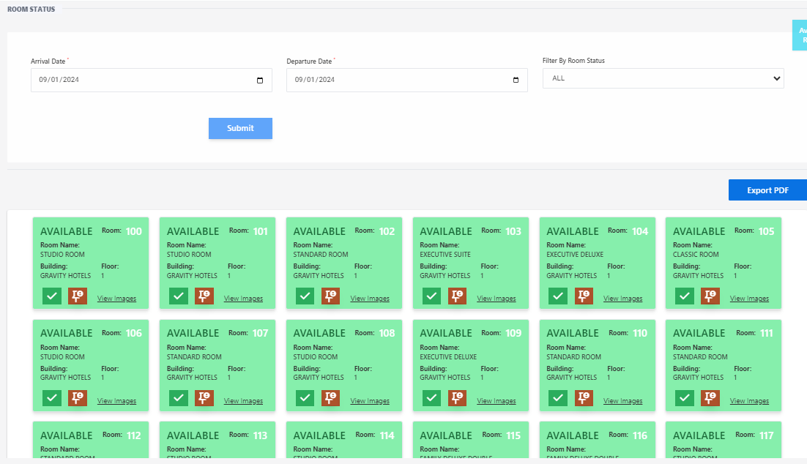

# Room Status

**HEMS - Hotel Manager**

## Room Status

The **Room Status** page provides an overview of the current status of all rooms in the hotel. This page helps hotel staff manage room availability, check occupancy, and ensure efficient room allocation.

## Overview

- **Arrival Date**: The date when the guest is expected to check in.
- **Departure Date**: The date when the guest is expected to check out.
- **Filter by Room Number**: Allows staff to filter the room status by specific room numbers.
- **Submit**: Button to apply the selected filters.

## Room Status Grid

The grid displays the status of each room with the following details:

- **Room Number**: The number assigned to the room.
- **Guest Capacity**: The maximum number of guests the room can accommodate.
- **Bed Type**: The type of bed(s) available in the room.
- **Status**: Indicates whether the room is available or occupied. 
  - **Green**: Available
  - **Red**: Occupied

## Example

| Room Number | Guest Capacity | Bed Type | Status   |
|-------------|----------------|----------|----------|
| 100         | 2              | Queen    | Available|
| 101         | 2              | Queen    | Occupied |
| 102         | 4              | King     | Available|
| 103         | 2              | Twin     | Occupied |

## Actions

- **Export PDF**: Allows staff to export the room status information as a PDF document for record-keeping or reporting purposes.

## Steps to Use the Room Status Page

1. **Select Arrival and Departure Dates**: Use the calendar options to choose the desired dates.
2. **Filter by Room Number**: (Optional) Enter a specific room number to filter the results.
3. **Submit**: Click the "Submit" button to apply the filters and view the room status.
4. **Review Room Status**: Check the grid to see the availability and status of each room.
5. **Export PDF**: If needed, click the "Export PDF" button to save the room status information.

By using the **Room Status** page, hotel staff can efficiently manage room assignments, monitor occupancy, and ensure a smooth check-in and check-out process for guests.
