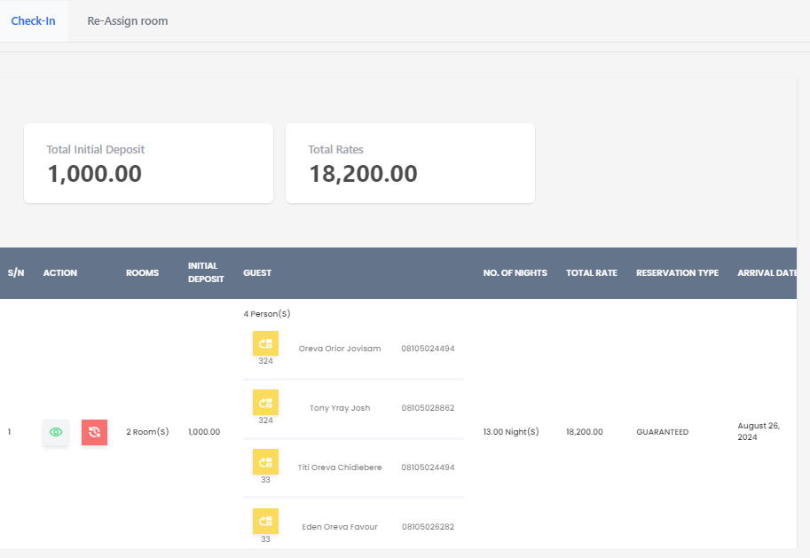

# Room Transfer

**HEMS - Hotel Manager**

## Re-Assign Room

The **Re-Assign Room** feature allows hotel staff to change the room assignment for a guest's reservation. This can be useful in various scenarios, such as accommodating guest preferences, managing overbookings, or handling maintenance issues.

## Overview

- **Total Initial Deposit**: The total amount deposited by the guest at the time of booking.
- **Total Rates**: The total cost of the stay, including all applicable rates.

## Room Assignment Table

| S/N | Action | Rooms | Deposit | Guest | # of Nights | Total Rate | Reservation Type | Arrival Date |
|-----|--------|-------|---------|-------|-------------|------------|------------------|--------------|
| 1   | -      | 4     | 1,000.00| Oreva Orier Jovsam | 13 | 18,200.00 | Guaranteed | August 26, 2024 |
| 2   | -      | 2     | 1,000.00| Tony Yroy Josh | 13 | 18,200.00 | Guaranteed | August 26, 2024 |
| 3   | -      | 33    | 1,000.00| Titi Oreva Chidiebere | 13 | 18,200.00 | Guaranteed | August 26, 2024 |

## Steps to Re-Assign a Room

1. **Select the Reservation**: Choose the reservation you want to re-assign from the table.
2. **Choose a New Room**: Select the new room from the available options.
3. **Confirm the Change**: Verify the details and confirm the re-assignment.

## Important Notes

- Ensure that the new room meets the guest's requirements and preferences.
- Update the guest's information and notify them of the change.
- Adjust the total rates and deposits if necessary.

By using the **Re-Assign Room** feature, you can efficiently manage room allocations and enhance guest satisfaction.
