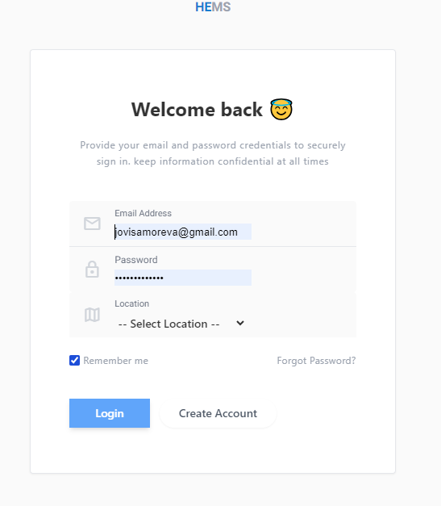

# Login

**HEMS - Hotel Manager**

# Login Page

The **HEMS Hotel Management Software** login page allows returning users to securely sign in to their accounts. Below is a description of the fields and available actions on this page.

## Fields

- **Email Address**: Enter the email address associated with your HEMS account. This field is required to log in.
- **Password**: Input the password you created during registration. Ensure that the password is entered correctly to avoid login issues.
- **Location**: Select the hotel or branch location from the dropdown list. This helps in identifying the specific branch you are logging into.

## Options

- **Remember me**: Check this box if you want the system to remember your login details on this device. This option is useful if you frequently access the platform from the same device.
- **Forgot Password?**: If you have forgotten your password, click on this link to initiate the password recovery process. You will be guided through steps to reset your password.

## Actions

- **Login**: After filling in the required fields, click the `Login` button to access your account.
- **Create Account**: If you do not have an account, click the `Create Account` button to be redirected to the registration page.

## Notes

- Ensure that your login credentials (email and password) are kept confidential to maintain account security.
- The location selection is crucial for users managing multiple branches, as it ensures you're logging into the correct branch of the hotel.

---

This documentation provides an overview of the login process for users of the HEMS Hotel Management Software. For any login issues, users are encouraged to visit the Help & Support section or submit a support ticket.
