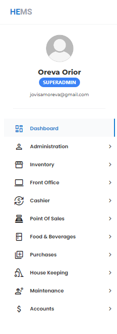

# Navbar

**HEMS - Hotel Manager**

# HEMS Navigation Bar

The HEMS navigation bar provides quick access to various sections of the hotel management system. Below is a detailed explanation of each section:

## User Profile
- **User Information**: Displays the user's name and role.
  - **Name**: Oreva Orior
  - **Role**: SUPERADMIN
  - **Email**: jovisamoreva@gmail.com

## Navigation Links
- **Dashboard**: The main overview page of the hotel management system.
  - **Icon**: Dashboard icon.

- **Administration**: Access to administrative functions and settings.
  - **Icon**: Administration icon.

- **Inventory**: Manage and view the hotel's inventory.
  - **Icon**: Inventory icon.

- **Front Office**: Operations related to the front office, such as check-ins and check-outs.
  - **Icon**: Front Office icon.

- **Cashier**: Financial transactions and cashier-related activities.
  - **Icon**: Cashier icon.

- **Point Of Sales**: Sales transactions and related activities.
  - **Icon**: Point Of Sales icon.

- **Food & Beverages**: Manage food and beverage services.
  - **Icon**: Food & Beverages icon.

- **Purchases**: Track and manage purchases.
  - **Icon**: Purchases icon.

- **House Keeping**: Housekeeping operations and management.
  - **Icon**: House Keeping icon.

- **Maintenance**: Maintenance tasks and schedules.
  - **Icon**: Maintenance icon.

- **Accounts**: Financial accounts and related activities.
  - **Icon**: Accounts icon.

This navigation bar is designed to provide easy access to all the essential functions of the hotel management system, ensuring efficient and streamlined operations.
