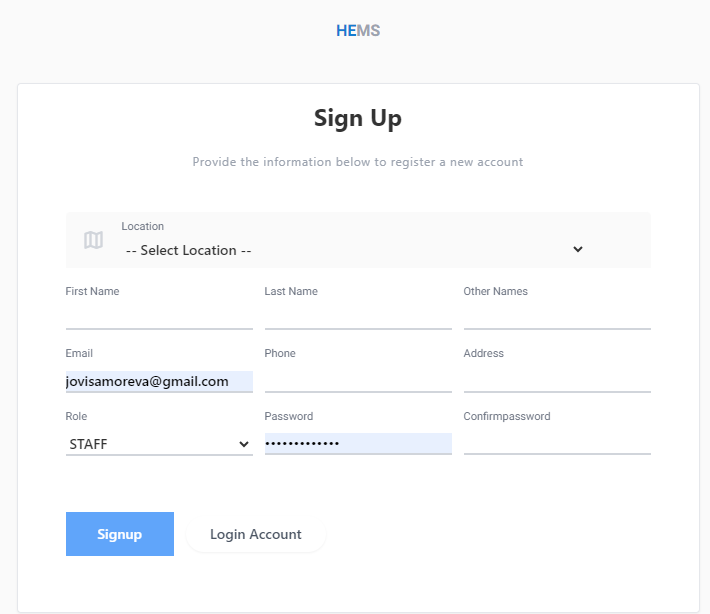

# Registration

**HEMS - Hotel Manager**

The **HEMS Hotel Management Software** registration page allows new users to create an account by providing essential details. Below is an overview of the fields and their descriptions.

## Fields

- **Location**: Select the location of the hotel or branch from the dropdown list. This is a required field.
- **First Name**: Enter the user's first name.
- **Last Name**: Enter the user's last name.
- **Other Names**: Enter any additional names the user may have (optional).
- **Email**: Provide a valid email address. This will be used for account verification and communication.
- **Phone**: Enter the user's phone number for contact purposes.
- **Address**: Provide the user's physical address.
- **Role**: Select the user's role from the dropdown list. Available options may include roles like `STAFF`, `MANAGER`, etc.
- **Password**: Create a secure password for the account. The password should meet the security criteria set by the system.
- **Confirm Password**: Re-enter the password to confirm it matches.

## Actions

- **Signup**: Once all required fields are filled, click the `Signup` button to create a new account.
- **Login Account**: If the user already has an account, they can click on `Login Account` to be redirected to the login page.

## Notes

- Ensure that all mandatory fields are completed before submitting the form.
- The password must be secure and follow the guidelines provided by the system.
- In case of any issues during registration, users are encouraged to visit the Help & Support section or submit a support ticket.

---

This documentation should provide users with a clear understanding of how to use the registration page to create a new account on the HEMS Hotel Management Software platform.