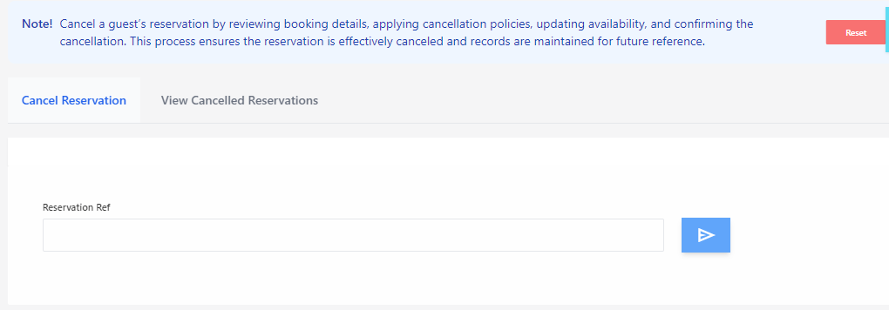
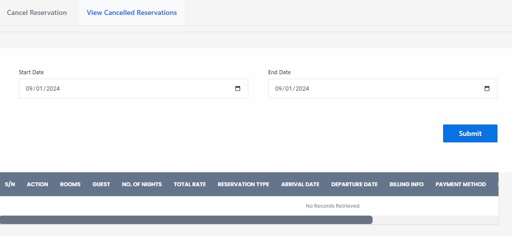

# Cancel Reservation

**HEMS - Hotel Manager**

## Cancel Reservation Page

The **Cancel Reservation** page allows hotel staff to manage and process the cancellation of guest reservations. This page ensures that cancellations are handled efficiently and records are maintained for future reference.

## Features

- **Reservation Reference**: Enter the reservation reference number to retrieve the booking details.
- **Cancellation Policies**: Review and apply the hotel's cancellation policies.
- **Update Availability**: Adjust room availability based on the cancellation.
- **Confirm Cancellation**: Finalize the cancellation process and update the reservation status.

## How to Use

1. **Enter Reservation Reference**: Input the reservation reference number in the provided field and click the search button.
2. **Review Booking Details**: Check the details of the reservation to ensure accuracy.
3. **Apply Cancellation Policies**: Follow the hotel's policies regarding cancellations, including any fees or penalties.
4. **Update Availability**: Adjust the room availability to reflect the cancellation.
5. **Confirm Cancellation**: Click the 'Cancel Reservation' button to complete the process.

## Notes

- Ensure that all cancellation policies are reviewed and applied correctly.
- The system will update the reservation status to 'Cancelled' once the process is completed.
- Use the 'View Cancelled Reservations' tab to review past cancellations.

By using the **Cancel Reservation** page, hotel staff can efficiently manage reservation cancellations, ensuring that all necessary steps are followed and records are updated accurately.

# View Cancelled Reservations Page

The **View Cancelled Reservations** page allows hotel staff to review and manage all reservations that have been cancelled. This page provides a detailed overview of cancelled bookings within a specified date range, ensuring that all cancellations are tracked and recorded accurately.

## Features

- **Date Range Selection**: Choose the start and end dates to filter cancelled reservation records.
- **Submit Button**: Click to retrieve cancelled reservation records for the selected date range.
- **Cancelled Reservations Table**: Displays detailed information about each cancelled reservation, including:
  - **S/N**: Serial number of the cancellation record.
  - **Action**: Available actions for each record.
  - **Rooms**: Room number associated with the cancelled reservation.
  - **Guest**: Name of the guest.
  - **No. of Nights**: Number of nights the reservation was for.
  - **Total Rate**: Total amount that was to be charged for the stay.
  - **Reservation Type**: Type of reservation (e.g., standard, group).
  - **Arrival Date**: Original check-in date.
  - **Departure Date**: Original check-out date.
  - **Billing Info**: Billing information for the reservation.
  - **Payment Method**: Method used for payment.

## How to Use

1. **Select Date Range**: Use the date pickers to choose the start and end dates for the cancelled reservation records you want to view.
2. **Submit**: Click the 'Submit' button to retrieve the cancelled reservation records for the specified date range.
3. **Review Records**: Examine the details in the cancelled reservations table to verify and manage cancellations.

## Notes

- Ensure the date range covers the period you are interested in to get accurate records.
- Use the action buttons to perform tasks such as viewing detailed billing information or correcting any discrepancies.

By using the **View Cancelled Reservations** page, hotel staff can efficiently monitor and manage all cancelled reservations, ensuring that all necessary steps are followed and records are updated accurately.
