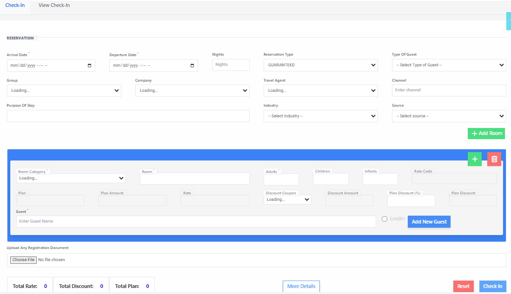
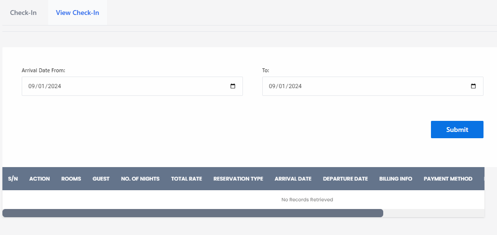

# Direct Check-In

**HEMS - Hotel Manager**

## Check-In Process

The check-in process is a crucial part of managing guest entries in a hotel. This guide will walk you through the steps involved in checking in a guest using our hotel management software.

## Steps to Check-In a Guest

1. **Navigate to the Check-In Page**
   - Go to the main menu and select the "Check-In" option.

2. **Enter Guest Information**
   - Fill in the required fields such as:
     - **Event ID**: Unique identifier for the guest's reservation.
     - **Name**: Full name of the guest.
     - **Email**: Guest's email address for communication.
     - **Company**: If applicable, the company the guest is associated with.
     - **Type of Guest**: Specify whether the guest is a regular, VIP, or other types.

3. **Add Room Details**
   - Click on the "Add Room" button to assign a room to the guest.
   - Select the room type and number from the available options.

4. **Add New Guest (if applicable)**
   - If the guest is not already in the system, click on "Add New Guest" to input their details.

5. **Review and Confirm**
   - Double-check all the entered information for accuracy.
   - Confirm the check-in by clicking the "Check-In" button.

6. **Issue Key/Access Card**
   - Provide the guest with their room key or access card.

7. **Finalize Check-In**
   - Ensure all details are saved and the guest is successfully checked in.

## Additional Features

- **View Check-In**: Allows you to view the details of guests who have already checked in.
- **Reservation Details**: Access and manage reservation details, including dates and room preferences.
- **Guest Management**: Manage guest profiles, including personal information and stay history.

By following these steps, you can ensure a smooth and efficient check-in process for your guests, enhancing their overall experience at your hotel.

# View Check-In

The "View Check-In" feature allows hotel staff to review and manage the details of guests who have checked in. This guide will help you understand how to use this feature effectively.

## Steps to View Check-In Records

1. **Navigate to the View Check-In Page**
   - Go to the main menu and select the "View Check-In" option.

2. **Set the Date Range**
   - Use the "Arrival Date From" and "To" fields to specify the date range for the check-in records you want to view.
   - Example: Enter `09/01/2024` in both fields to view check-ins for that specific date.

3. **Submit the Search**
   - Click the "Submit" button to retrieve the check-in records for the specified date range.

4. **Review the Check-In Records**
   - The results will be displayed in a table format with the following columns:
     - **#**: Serial number of the record.
     - **Action**: Actions you can take on the record (e.g., edit, delete).
     - **Room**: Room number assigned to the guest.
     - **Guest**: Name of the guest.
     - **# of Nights**: Number of nights the guest is staying.
     - **Total Charge**: Total charge for the stay.
     - **Reservation Type**: Type of reservation (e.g., guaranteed, tentative).
     - **Arrival Date**: Date of arrival.
     - **Departure Date**: Date of departure.
     - **Billing Payment Method**: Method of payment used for billing.

5. **No Records Retrieved**
   - If no records match the search criteria, a message saying "No Records Retrieved" will be displayed.

## Additional Features

- **Filter Options**: You can refine your search by adjusting the date range or other criteria.
- **Action Buttons**: Use the action buttons to edit or delete check-in records as needed.
- **Detailed View**: Click on a record to view more detailed information about the guest's stay.

By following these steps, you can efficiently manage and review guest check-in records, ensuring a smooth operation at your hotel.

