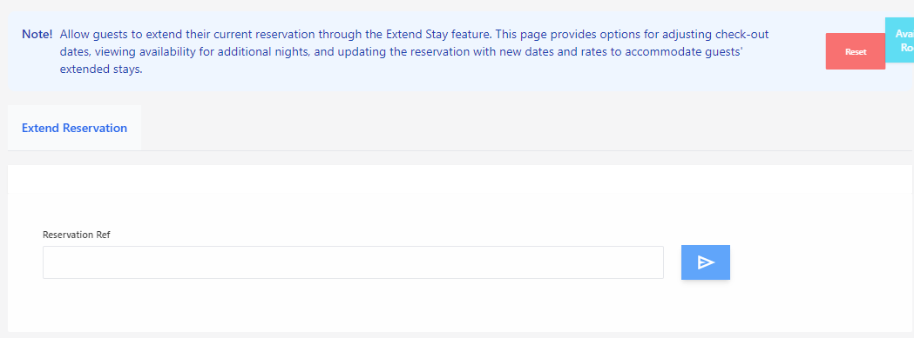

# Extend Stay

**HEMS - Hotel Manager**

## Extend Reservation Page

The **Extend Reservation** page allows guests to prolong their current stay at the hotel. This page provides options for adjusting check-out dates, viewing availability for additional nights, and updating the reservation with new dates and rates.

## Features

- **Reservation Reference**: Enter the reservation reference number to retrieve the current booking details.
- **Check-out Date Adjustment**: Modify the check-out date to extend the stay.
- **Availability Check**: View the availability of rooms for the additional nights.
- **Update Reservation**: Confirm and update the reservation with the new dates and rates.

## How to Use

1. **Enter Reservation Reference**: Input the reservation reference number in the provided field.
2. **Adjust Check-out Date**: Select the new desired check-out date.
3. **Check Availability**: Ensure that rooms are available for the extended period.
4. **Update Reservation**: Click the update button to finalize the changes.

## Notes

- Ensure that the new check-out date does not conflict with existing bookings.
- The system will automatically calculate the new rates based on the extended stay.

By using the **Extend Reservation** page, guests can easily manage their stay extensions without needing to contact the front desk.
