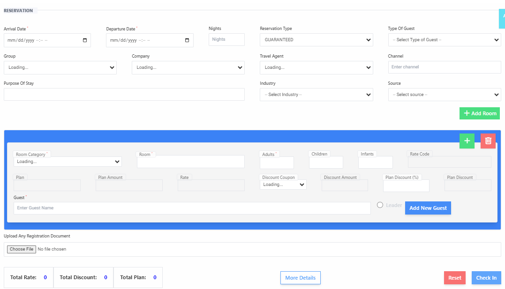

# Group Check-in

**HEMS - Hotel Manager**

## Check-In

The group check-in feature allows you to efficiently manage the check-in process for multiple guests under a single reservation. This is particularly useful for events, corporate bookings, or large family gatherings. Here's how to use the group check-in page:

## Steps to Check-In a Group

1. **Navigate to the Group Check-In Page**
   - Go to the main menu and select the "Group Check-In" option.

2. **Enter Reservation Details**
   - **Arrival Date**: Enter the arrival date for the group. Use the format `mm/dd/yyyy`.
   - **Departure Date**: Enter the departure date for the group. Use the format `mm/dd/yyyy`.
   - **Nights**: The system will automatically calculate the number of nights based on the arrival and departure dates.
   - **Reservation Type**: Select the type of reservation (e.g., guaranteed, tentative).
   - **Type of Guest**: Choose the type of guest (e.g., regular, VIP).

3. **Enter Group Information**
   - **Group**: Enter the name of the group.
   - **Company**: If applicable, enter the company name.
   - **Travel Agent**: If applicable, enter the travel agent's name.
   - **Channel**: Select the booking channel (e.g., online, walk-in).

4. **Specify Purpose and Source**
   - **Purpose of Stay**: Enter the purpose of the group's stay.
   - **Industry**: Select the industry if applicable.
   - **Source**: Select the source of the booking.

5. **Add Rooms and Guests**
   - Click on the "+ Add Room" button to assign rooms to the group.
   - Click on the "+ Add Guest" button to add individual guests to the reservation.

6. **Upload Documents**
   - If required, upload any registration documents by clicking on the "Choose File" button.

7. **Review and Confirm**
   - Double-check all the entered information for accuracy.
   - Confirm the check-in by clicking the "Check-In" button.

## Additional Features

- **Room Category**: Select the category of rooms being booked.
- **Adults and Infants**: Specify the number of adults and infants in the group.
- **Rate Code**: Enter the rate code if applicable.
- **Discounts**: Apply any discounts by entering the discount code and amount.
- **Total Rate and Discounts**: The system will display the total rate and any applicable discounts.

By following these steps, you can ensure a smooth and efficient check-in process for group reservations, enhancing the overall experience for your guests.

# View Group Check-In

The "View Group" feature allows you to review and manage the details of group reservations. This guide will help you understand how to use this feature effectively.

## Steps to View Group Reservations

1. **Navigate to the View Group Page**
   - Go to the main menu and select the "View Group" option.

2. **Review Group Reservation Records**
   - The records will be displayed in a table format with the following columns:
     - **S/N**: Serial number of the record.
     - **Action**: Actions you can take on the record (e.g., edit, delete).
     - **Rooms**: Number of rooms booked for the group.
     - **Guest**: Number of guests in the group.
     - **No. of Nights**: Total number of nights for the stay.
     - **Total Rate**: Total cost of the reservation.
     - **Reservation Type**: Type of reservation (e.g., guaranteed, tentative).
     - **Arrival Date**: Date of arrival.
     - **Departure Date**: Date of departure.
     - **Billing Info**: Billing information for the reservation.
     - **Payment Method**: Method used for payment.

3. **No Records Retrieved**
   - If no records match the search criteria, a message saying "No Records Retrieved" will be displayed.

## Additional Features

- **Filter Options**: Use the date fields or other criteria to filter group reservations.
- **Action Buttons**: Use the action buttons to edit or delete existing reservations.
- **Detailed View**: Click on a record to view more detailed information about the group's stay.

By following these steps, you can efficiently manage and review group reservations, ensuring a smooth operation at your hotel.
