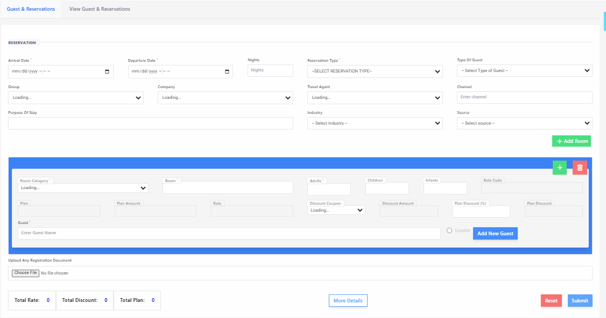
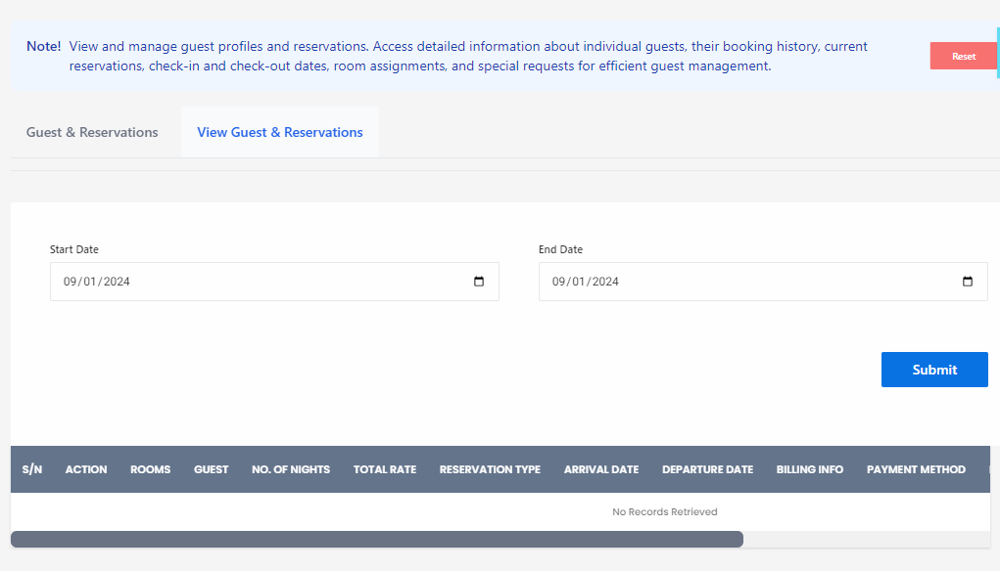

# Guests & Reservation

**HEMS - Hotel Manager**



## Guest & Reservations Page

The **Guest & Reservations** page is designed to manage and track guest information and their reservations efficiently. This page is divided into several sections to ensure all necessary details are captured and easily accessible.

## Guest Information

At the top of the page, you will find fields to input the guest's personal information:

- **Name**: Enter the guest's full name.
- **Email**: Provide the guest's email address.
- **Phone Number**: Input the guest's contact number.
- **Company Name**: If applicable, enter the name of the company the guest is associated with.

## Reservation Details

Below the guest information, there are fields and dropdown menus to manage reservation specifics:

- **Room Type**: Select the type of room the guest will be staying in from the dropdown menu.
- **Payment Type**: Choose the payment method (e.g., credit card, cash).
- **Reservation Status**: Indicate the current status of the reservation (e.g., checked-in, reserved).
- **Arrival Date**: Use the date picker to select the guest's arrival date.
- **Departure Date**: Use the date picker to select the guest's departure date.

## Tabs

The page includes a blue banner with two tabs:

- **Guest Reservations**: This tab displays a list of all current reservations.
- **Visit & Guest Info**: This tab provides detailed information about the guest's visit.

## Guest List

In the main area, you can add new guests and view existing ones. Each entry includes:

- **Title**: The guest's title (e.g., Mr., Mrs., Dr.).
- **First Name**: The guest's first name.
- **Last Name**: The guest's last name.
- **Email Address**: The guest's email.
- **Phone Number**: The guest's contact number.
- **Discount Amount**: Any discount applied to the guest's stay.
- **Total Amount Due**: The total amount the guest needs to pay.
- **Actions**: Buttons to edit or delete the guest's information.

## Summary Section

At the bottom of the page, there are buttons and fields summarizing the financial aspects of the reservations:

- **Total Cost**: Displays the total cost of all reservations.
- **Total Discount**: Shows the total discount applied.
- **Total Due**: Indicates the total amount due from all guests.
- **Print**: Button to print the reservation details.
- **More Details**: Option to view more detailed information.
- **Reset**: Button to reset the form or table.

This page ensures that all guest and reservation details are organized and easily manageable, providing a seamless experience for both the staff and the guests.



## View Guest & Reservations

The "View Guest & Reservations" page allows hotel staff to manage guest profiles and reservations efficiently. This page provides detailed information about individual guests, their booking history, current reservations, check-in and check-out dates, room assignments, and special requests.

## Features

### Date Range Filter
Allows users to filter reservations based on a specific date range.

```markdown
## Date Range Filter
- **Start Date:** Select the start date for the reservation search.
- **End Date:** Select the end date for the reservation search.
- **Submit Button:** Click to apply the date range filter and view relevant reservations.


## Reservations Table
The table includes the following columns:
- **SL:** Serial number of the reservation.
- **Action:** Actions that can be performed on the reservation (e.g., edit, delete).
- **Rooms:** Room number(s) assigned to the reservation.
- **Guest:** Name of the guest.
- **No Of Nights:** Number of nights the guest will stay.
- **Reservation Type:** Type of reservation (e.g., online, walk-in).
- **Arrival Date:** Check-in date.
- **Departure Date:** Check-out date.
- **Billing Info:** Billing information for the reservation.
- **Payment Method:** Method of payment used by the guest.


## No Records Retrieved
If no reservations match the selected date range or other filters, a message will be displayed: "No Records Retrieved".


