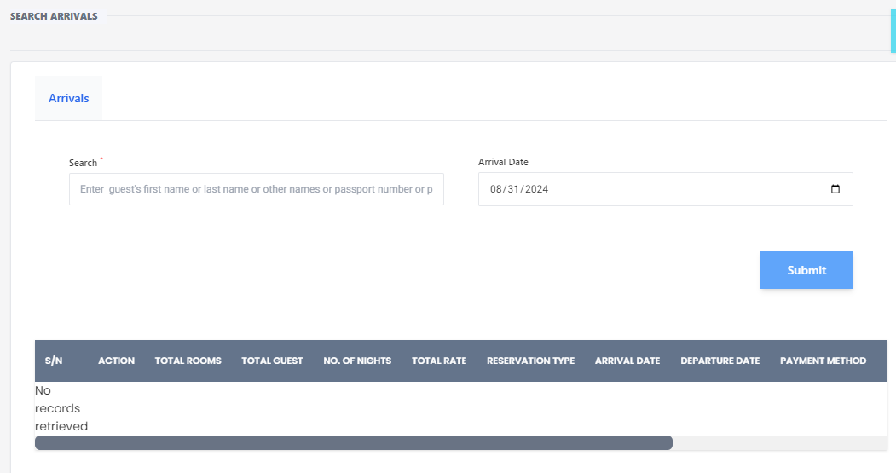

# Search Arrivals

**HEMS - Hotel Manager**

## Search Arrivals

The **Search Arrivals** page allows hotel staff to search for guest arrivals based on various criteria. This page is essential for managing and tracking guest check-ins efficiently.

## Features

### Search Form
- **Guest Information**: Enter the guest's first name, last name, other names, or passport number to search for their arrival details.
- **Arrival Date**: Select or enter the arrival date to filter the search results.
- **Submit Button**: Click the 'Submit' button to execute the search based on the provided criteria.

### Search Results Table
- **S/N**: Serial number of the search results.
- **Action**: Actions that can be performed on the search results.
- **Total Rooms**: Number of rooms booked by the guest.
- **Total Guest**: Number of guests included in the booking.
- **No. of Nights**: Duration of the stay in nights.
- **Total Rate**: Total cost of the booking.
- **Reservation Type**: Type of reservation (e.g., online, walk-in).
- **Arrival Date**: Date of arrival.
- **Departure Date**: Date of departure.
- **Payment Method**: Method of payment used by the guest.

### No Records Retrieved
- If no matching records are found, the table will display "No records retrieved".

## Usage
1. **Enter Search Criteria**: Fill in the guest's information and/or arrival date.
2. **Submit Search**: Click the 'Submit' button to view the search results.
3. **Review Results**: Check the table for the guest's arrival details and perform any necessary actions.

This page helps streamline the check-in process by providing quick access to guest arrival information.
